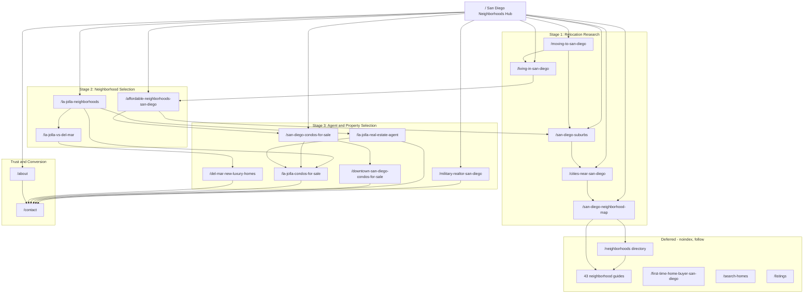

# SDCommunities Rebuild Plan: 15 Keyword Clusters

Planning document only. No code changes are authorized by this document.

Evidence base:

- `google_us_sandiego_list-overview_serps_2026-07-26_18-12-13.csv` (403 unique keywords, 6,656 SERP rows, US, pulled 2026-07-20/26).
- Full repository audit of `src/app`, `src/data`, `src/components`, `src/lib`, `scripts/`, `docs/`, `next.config.ts`.

---

## 1. Executive Diagnosis

**The site has zero measurable organic presence in its own target market.** Across all 403 keywords and 6,656 SERP rows in the export, `sdcommunities.com` and the legacy `sandiegorelocationhomeguide.com` appear **0 times**. Not a single top-100 placement was captured in the entire San Diego neighborhood/relocation/condo keyword universe.

This is the single most important fact in the plan, and it changes the risk calculus completely: **there is no ranking equity to protect.** Consolidation, noindexing, and re-routing carry almost no downside. The usual objection to aggressive pruning ("you'll lose the impressions you have") does not apply here.

### Root causes, in order of severity

**1. Fifty-four indexable URLs, forty-three of which are near-identical templated neighborhood guides.**

`src/app/sitemap.ts` submits 54 URLs. Forty-three of them are `/neighborhoods/[slug]` pages generated from one template (`src/app/neighborhoods/[slug]/page.tsx`) hydrated from one content shape (`CommunityContent` in `src/data/community-content.ts`: `whoItsFor`, `housingOverview`, `lifestyle`, `commute`, `nearbyComparisons`, `faqs`, `stats`). Every page has the same H1 pattern (`Living in {name}: A Buyer's Guide`), the same section order, and the same module set. From a crawler's perspective this is 43 documents with one differentiating variable.

**2. Most of those 43 slugs have no independent search demand.**

The export contains no meaningful keyword volume for the majority of the subareas the site has built pages for. `living in point loma`, `living in clairemont san diego`, `living in university city san diego`, `living in mission valley san diego`, `living in carmel valley san diego`, `living in pacific beach` — all return **0** volume. `living in north park san diego` is 20/mo. `living in ocean beach san diego` is 10/mo. `living in del mar` is 10/mo. Thirty of the 43 slugs are tier-2/tier-3 *subareas* of other slugs (`bird-rock`, `muirlands`, `windansea`, `mount-soledad`, `torrey-hills`, `civita`, `bay-ho`, `morena`...) with essentially no standalone query demand at all.

The launch theory in the prompt is correct and the data confirms it.

**3. Internal keyword ownership is already conflicting.**

The homepage title is `San Diego Relocation Home Guide | Neighborhood Guidance & Home Search` and its H1 is `Moving to San Diego? Start With a Clear Home-Buying Plan.` — that H1 competes directly with `/relocating-to-san-diego`. Meanwhile `/neighborhoods` is titled `San Diego Neighborhoods Near La Jolla`, which is the term the homepage should own. And the root layout title template (`%s | San Diego Relocation Home Guide`, `src/app/layout.tsx`) injects the word "Relocation" into the title of every page on the site, diluting every non-relocation cluster.

**4. The site is optimized for a keyword set that barely exists.**

The current information architecture is built on "relocating to San Diego" (30/mo in the export) and "moving to La Jolla" (**not present in the export at all**). The actual demand is `moving to san diego` at 1,000/mo and `san diego neighborhoods` at 1,500/mo. The site chose the low-volume synonym in both cases.

**5. Nothing is noindexed and nothing is excluded.**

`src/app/robots.ts` returns a bare `allow: /` with no disallow rules. The only `robots: { index: false }` in the entire codebase is on `/listings?page=2+`. Every legal page, the search utility page, and all 43 templated guides are submitted for indexing with equal priority (0.8–0.9).

### The opportunity the data actually supports

The San Diego neighborhood-research SERPs are **not owned by real estate.** They are owned by Reddit, Wikipedia, tourism boards, and rental/self-storage content marketing. Concrete evidence from the export:

- `san diego neighborhoods` (1,500/mo): #1 Reddit, #2 Wikipedia, #3 **gosandiego.com at DR29**, #5 sandiego.org (tourism board). No real estate site in the top five.
- `san diego neighborhood map` (500/mo): #2 gosandiego.com DR29, **#3 sdhousingmarket.com at DR18**, #4 an SDSU library guide, #5 sandiego.gov. This is one of the weakest commercially-relevant SERPs in the entire dataset.
- `military realtor san diego` (70/mo): **#1 sandiegomilitaryre.com at DR2**, #3 an Instagram profile, **#4 tipofthespearrealtors.com at DR2**, #5 Reddit.
- `la jolla neighborhoods` (150/mo): the only organic top-five result captured is **lajollaestatehomes.com at DR0**.
- `downtown san diego condos for sale`: portals hold #1/#2/#4/#5 — but **svpremier.com at DR5 holds #3**, and the same DR5 site holds #2 for `san diego high rise condos for sale` and #4 for `condos for sale little italy san diego`. A DR5 site is beating Trulia and Redfin in this vertical because it is structured by district and by building. This is the clearest proof in the dataset that page-level structure beats domain authority in San Diego condo search.
- `moving to san diego` (1,000/mo): #2 Reddit, **#4 nelsonwesterberg.com at DR36** (a moving company), #5 a Facebook group post.
- `living in san diego` (1,200/mo): #2 Reddit, **#4 spendlifetraveling.com at DR39** (a travel blog).

A well-structured, genuinely differentiated set of 15 pages can win most of these. Forty-three cloned subarea pages never will.

---

## 2. Spreadsheet and SERP Findings

### Method

For each cluster I computed (a) combined monthly volume across all matching keywords in the export, (b) the Ahrefs Parent Topic and Parent Topic Volume — which is the single best available cannibalization signal because Ahrefs assigns a shared parent when it observes one page ranking for multiple queries, (c) the Ahrefs Traffic Potential of the current #1 page, which is the realistic ceiling, and (d) the organic top-five composition with Domain Rating.

KD was deliberately ignored as a ranking signal. In this dataset KD is near-useless: `condos for sale san diego` shows **KD 1** with a 100% portal top five, while `la jolla cove san diego` shows **KD 53** on a pure tourism SERP.

### Cluster-level volume totals from the export

- San Diego neighborhoods family (all variants, excluding map/suburb/La Jolla): **7,760/mo** across 36 keywords. Ahrefs TP ceiling **1,800**.
- Living in San Diego family (incl. safety and pros/cons): **5,740/mo** across 17 keywords.
- Cities/towns near San Diego: **2,370/mo** across 9 keywords. TP 700.
- San Diego suburbs: **1,950/mo** across 5 keywords. TP 1,500.
- Moving to San Diego: **1,490/mo** across 9 keywords. TP 700.
- San Diego neighborhood map: **1,320/mo** across 5 keywords. TP 350.
- La Jolla condos: **1,600/mo** across 10 keywords. TP 900.
- Del Mar new + luxury: **1,150/mo** across 5 keywords. TP 150.
- Downtown / high-rise / district condos: **1,000/mo** across 11 keywords. TP 150.
- Affordable / cheapest San Diego housing: **1,060/mo** across 11 keywords. TP 400.
- La Jolla neighborhoods + orientation: **850/mo** across 4 keywords. TP 50.
- La Jolla agent selection: **300/mo** across 2 keywords. TP 80.
- Mission Valley condos: **280/mo** across 4 keywords. TP **20**.
- La Jolla vs Del Mar: **220/mo** across 3 keywords, and 150 of that is the ambiguous `la jolla del mar`. TP 30.
- Military realtor: **70/mo**, 1 keyword. TP 20.
- All San Diego condo queries combined: **11,970/mo** across 94 keywords. TP 3,300 on the head term.

### Three findings that changed the proposed architecture

**Finding A — the homepage and `/best-neighborhoods-san-diego` are one opportunity, not two.**

Ahrefs assigns `san diego neighborhoods` (1,500/mo) the Parent Topic `best neighborhoods in san diego` (800/mo). That is Ahrefs stating it has observed a single page ranking for both. The SERPs confirm it directly: the Reddit thread `/r/asksandiego/comments/12yi071` ranks **#1** for `san diego neighborhoods`, **#2** for `best neighborhoods in san diego`, **#2** for `where to live in san diego`, and **#4** for `san diego neighborhood guide`. Both keywords report the identical Traffic Potential of **1,800**, because it is the same ceiling being measured. Building two pages would split link equity and internal relevance signals across a single SERP intent.

*Resolution (confirmed with stakeholder): the homepage owns the entire family. `/best-neighborhoods-san-diego` is removed from the architecture.*

**Finding B — Mission Valley condos is the weakest cluster in the proposed set by a wide margin.**

`condos for sale in mission valley san diego` has a **100% portal top five** — Zillow #1, Redfin #2, Realtor #3, Trulia #4, Homes.com #5 — with no weak, outdated, or poorly-matched result anywhere in it. Traffic Potential is **20**. It fails the stated criterion "weak, outdated, poorly matched, or low-authority websites ranking in the top five" outright. Compare the Downtown equivalent, where a DR5 site holds #3.

*Resolution (confirmed with stakeholder): demote to a section inside a broader San Diego condo hub; defer the standalone route.*

**Finding C — `la jolla vs del mar` is a real but very small opportunity, and the query does not exist in the form proposed.**

The export contains no keyword `la jolla vs del mar`. It contains `del mar vs la jolla` at **40/mo** (TP 30), `la jolla to del mar` at 30/mo (driving-directions intent, not comparison intent), and `la jolla del mar` at 150/mo — which on inspection is a **listings/vacation-rental** SERP (`bajaregroup.com/listings-in-la-jolla`, `lajollaexcellence.com`, a VRBO property page), not a comparison SERP. So the real addressable comparison demand is 40/mo.

The SERP is genuinely weak (#2 Reddit, #4 TripAdvisor forum, **#5 danesoderberg.com at DR9**) and trivially winnable. My recommendation was to fold it into `/la-jolla-neighborhoods`.

*Resolution (stakeholder elected to retain the standalone route).* It stays in the 15, but this plan treats it as the lowest-priority build (Phase 4), specifies a deliberately lightweight page model, and defines an explicit demotion trigger in §21. It should be understood as a conversion and topical-authority asset, not a traffic asset.

### Additional findings worth acting on

- **`/first-time-home-buyer-san-diego` cannot be won and is correctly excluded from the 15.** `san diego first time home buyer` (150/mo) has Parent Topic `first time home buyer program` (2,000/mo) and the SERP is owned by **sdhc.org — DR61, 242 referring domains, 3,357 monthly traffic** at #1, with the County of San Diego at #2. This is government down-payment-assistance intent, not agent-selection intent. No amount of content will displace a housing authority for a program query.
- **`is san diego safe` is 2,200/mo — the second-largest keyword in the export — and must be handled carefully.** Combined with `san diego crime rate` (900), `san diego crime map` (350), `is downtown san diego safe` (250), `safest neighborhoods in san diego` (200), and `is north park san diego safe` (150), safety is a ~4,000/mo demand cluster. It is also the highest Fair Housing risk surface on the site. See §15 — the recommendation is to answer safety questions with cited, official, city-level data on `/living-in-san-diego` only, and to never rank or compare neighborhoods by safety.
- **Tourism intent must be actively excluded.** `where to stay in san diego` (1,600/mo) and its 15+ variants (`best area to stay in san diego`, `best place to stay san diego`, etc.) total well over 4,000/mo and are pure hotel intent. `ocean beach san diego` (4,500/mo, the largest keyword in the export) is a tourism/AI-Overview SERP. These must not be targeted, and `/living-in-san-diego` and the homepage must be written so they do not accidentally drift toward them.
- **Rental intent contaminates the neighborhoods SERP.** `fairfieldresidential.com` (apartment operator) ranks #5 for `best neighborhoods in san diego` and `amsires.com` (rental management) ranks #5 for `san diego neighborhood guide`. The winning page must read unambiguously as a *buyer* resource to differentiate.
- **The brokerage is already a competitor on La Jolla terms.** `bhhscalifornia.com` (DR61) ranks **#4 for `la jolla homes for sale`** and #5 for `la jolla beach homes for sale`. This is Berkshire Hathaway HomeServices California Properties — the agent's own brokerage per `src/data/site-config.ts`. This is a strong argument for *not* adding a `/la-jolla-homes-for-sale` page (see §3) and for focusing La Jolla effort on agent-selection and condo intent instead.

---

## 3. Final 15-Cluster Recommendation

### The final set

| # | Route | Primary keyword | Combined vol | TP | Stage | Status |
|---|---|---|---|---|---|---|
| 1 | `/` | san diego neighborhoods | 7,760 | 1,800 | Selection | Rebuild |
| 2 | `/moving-to-san-diego` | moving to san diego | 1,490 | 700 | Research | Re-route + rebuild |
| 3 | `/living-in-san-diego` | living in san diego | 5,740 | 700 | Research | New |
| 4 | `/san-diego-suburbs` | san diego suburbs | 1,950 | 1,500 | Research | New |
| 5 | `/cities-near-san-diego` | cities near san diego | 2,370 | 700 | Research | New |
| 6 | `/san-diego-neighborhood-map` | san diego neighborhood map | 1,320 | 350 | Research | New (reuses map) |
| 7 | `/la-jolla-neighborhoods` | la jolla neighborhoods | 850 | 50 | Selection | Re-route + rebuild |
| 8 | `/la-jolla-vs-del-mar` | del mar vs la jolla | 40 | 30 | Selection | New (low priority) |
| 9 | `/military-realtor-san-diego` | military realtor san diego | 70 | 20 | Agent | Re-route + rebuild |
| 10 | `/la-jolla-real-estate-agent` | la jolla real estate agents | 300 | 80 | Agent | New |
| 11 | `/san-diego-condos-for-sale` | condos for sale san diego | ~9,000 net | 3,300 | Property | **New — backfill** |
| 12 | `/downtown-san-diego-condos-for-sale` | downtown san diego condos for sale | 1,000 | 150 | Property | New |
| 13 | `/la-jolla-condos-for-sale` | la jolla condos for sale | 1,600 | 900 | Property | New |
| 14 | `/del-mar-new-luxury-homes` | new homes for sale del mar | 1,150 | 150 | Property | New |
| 15 | `/affordable-neighborhoods-san-diego` | cheapest neighborhoods in san diego | 1,060 | 400 | Selection | **New — backfill** |

Plus two non-cluster indexable pages: `/about` (must be **created** — it does not currently exist) and `/contact` (exists).

### Changes from the proposed set, with evidence

**Removed: `/best-neighborhoods-san-diego`** — Finding A. Shared Ahrefs Parent Topic with the homepage, identical 1,800 TP ceiling, and the same Reddit thread ranks top-two on both SERPs. `best neighborhoods in san diego`, `best places to live in san diego`, `where to live in san diego`, `nicest neighborhoods in san diego`, and `best areas of san diego` all become **secondary keywords owned by the homepage**, expressed through an H2 and a decision-tool section rather than a separate URL.

**Removed: `/mission-valley-condos-for-sale`** — Finding B. 100% portal top five, TP 20. Becomes a **district section on `/san-diego-condos-for-sale`** with an anchor at `#mission-valley`, plus a link from `/neighborhoods/mission-valley`. Revisit as a standalone route only if the condo hub reaches page 1 for its head term.

**Added: `/san-diego-condos-for-sale`** — the largest untapped opportunity in the export. `condos for sale san diego` is 1,400/mo with TP **3,300**, and the export contains **94 condo keywords totalling 11,970/mo**, of which roughly 9,000/mo sits outside the La Jolla and Downtown clusters: Clairemont, Point Loma, Hillcrest, Bankers Hill, Little Italy, North Park, Pacific Beach, Carmel Valley, UTC, Gaslamp, Cortez Hill, Mission Beach, Tierrasanta, Scripps Ranch, Rancho Bernardo, Poway, Mira Mesa, Rancho San Diego, East County, North County, plus price bands (`under $200,000`, `under $300,000`, `under $250,000`), bedroom counts (`1 bedroom`, `2 bedroom`), and types (`new`, `high rise`, `beachfront`, `bayside`, `affordable`, `cheap`).

The head SERP is portal-dominated, so this is a medium-term play — but `svpremier.com at DR5` ranking #3 for `downtown san diego condos for sale`, #2 for `san diego high rise condos for sale`, and #4 for `condos for sale little italy san diego` is direct evidence that a district-and-building-structured condo resource outranks portals on the long tail. This page is designed as the hub for exactly that long tail, and it gives the demoted Mission Valley content a home.

**Added: `/affordable-neighborhoods-san-diego`** — backfills the slot freed by `/best-neighborhoods-san-diego`. 1,060/mo combined across `affordable homes in san diego` (200), `affordable homes san diego` (200), `cheapest neighborhoods in san diego` (100), `affordable places to live in san diego` (80), `affordable condos for sale in san diego` (90), and seven more variants. Parent topics (`affordable houses in san diego`, `cheapest neighborhoods in san diego`) are **distinct from `san diego neighborhoods`**, so there is no cannibalization with the homepage. Intent is tagged Transactional on the head terms. The SERP is beatable: #2 Zillow, **#3 sdhc.org**, #4 Redfin, **#5 firstteam.com at DR65** on the head term; Reddit + a UCSD off-campus-housing page on the informational variant.

Critically, this page is the natural home for the **price-positioning** axis that §8 of the brief explicitly names as safe, objective language — it lets the site serve the "where can I actually afford" question without ever touching the "safest"/"best schools"/"family" framing that Fair Housing forbids.

**Retained against my recommendation: `/la-jolla-vs-del-mar`** — see Finding C. Documented, scoped small, Phase 4, with a demotion trigger.

### Clusters explicitly rejected as standalone pages, with reasons

- **`/la-jolla-homes-for-sale`** (6,270/mo combined, TP 2,600). Tempting on volume, rejected on cannibalization: the site would then carry `/la-jolla-neighborhoods`, `/la-jolla-real-estate-agent`, `/la-jolla-condos-for-sale`, `/la-jolla-vs-del-mar`, and `/la-jolla-homes-for-sale` — five La Jolla pages, which is a smaller-scale repeat of the exact mistake that caused the current problem. Also, the top five is Zillow/Realtor/Redfin/Sotheby's/Trulia plus the agent's **own brokerage at DR61**. Defer to Phase 5 at the earliest, and only after `/la-jolla-real-estate-agent` and `/la-jolla-condos-for-sale` are both ranking.
- **`/del-mar-homes-for-sale`** (4,870/mo). Same reasoning; `/del-mar-new-luxury-homes` already carves the winnable, differentiated slice (new construction + luxury, where DR39 `whisselbeergroup.com` and DR19 `luxurycoastgroup.com` break into the top five). A general Del Mar page would cannibalize it and face Zillow/Realtor/Redfin/Sotheby's head-on.
- **`/san-diego-first-time-home-buyer`** — sdhc.org DR61 with 242 referring domains owns program intent. Existing page stays live but noindexed.
- **`/safest-neighborhoods-san-diego`** (200/mo, TP 300) — commercially attractive, **rejected on Fair Housing grounds**. See §15.
- **`/where-to-stay-in-san-diego`** and all `best area to stay` variants (4,000+/mo) — hotel intent, no path to a buyer conversation.
- **`/san-diego-townhomes-for-sale`** (600/mo, TP 700) — portal-dominated with no weak result; revisit as a section of the condo hub.
- **`/san-diego-beach-houses-for-sale`** (~1,200/mo across variants) — the head term `san diego beach house` (400/mo) has a **vacation-rental** SERP (bluewatervacationhomes.com #2, Airbnb #4). Intent mismatch.

---

## 4. Keyword-Ownership Matrix

Each row defines exactly one canonical owner for a query cluster. The "Must not target" column is the enforcement mechanism against cannibalization and must be honored in H1, title, and internal anchor text.

### 1. `/` — San Diego Neighborhoods hub

- **Primary:** `san diego neighborhoods` (1,500)
- **Secondary:** `best neighborhoods in san diego` (800), `neighborhood san diego` (500), `best places to live in san diego` (500), `neighborhoods in san diego` (350), `towns in san diego` (350), `parts of san diego` (300), `san diego areas` (250), `where to live in san diego` (200), `best areas to live in san diego` (200), `areas in san diego` (200), `san diego neighborhood guide` (150), `areas of san diego` (150), `neighborhoods of san diego` (150), `san diego districts` (150), `san diego communities` (70)
- **Intent:** Informational, non-local, with strong commercial undertone. Orientation before decision.
- **Purpose:** The single decision hub. Answer "what are the neighborhoods and which ones fit me" and route to every other page.
- **Conversion path:** Neighborhood finder → cluster page → consultation CTA. Secondary: direct strategy-call CTA in the agent-trust block.
- **Links to:** all 14 cluster pages, `/about`, `/contact`, `/neighborhoods` (directory utility)
- **Linked from:** every page (logo + breadcrumb root), footer, `/about`
- **Must not target:** `moving to san diego`, `living in san diego`, `san diego suburbs`, `san diego neighborhood map`, `cheapest/affordable neighborhoods`
- **Currently overlaps:** `/neighborhoods` (titled `San Diego Neighborhoods Near La Jolla` — direct conflict, resolved in §7)

### 2. `/moving-to-san-diego`

- **Primary:** `moving to san diego` (1,000)
- **Secondary:** `san diego relocation` (150), `move to san diego` (100), `should i move to san diego` (90), `reasons to move to san diego` (70), `moving to san diego california` (50), `relocating to san diego` (30), `san diego relocation guide`, `san diego moving guide`
- **Intent:** Informational, pre-decision, out-of-area. Logistics and sequencing.
- **Purpose:** The *process* guide — timeline, what to do in what order, remote-buying mechanics, cost expectations.
- **Conversion path:** Relocation checklist lead magnet (`LeadMagnet` exists) → email capture → strategy call.
- **Links to:** `/living-in-san-diego`, `/`, `/san-diego-suburbs`, `/cities-near-san-diego`, `/military-realtor-san-diego`, `/contact`
- **Linked from:** `/`, `/living-in-san-diego`, header, footer
- **Must not target:** `living in san diego`, `is san diego a good place to live`, `pros and cons of living in san diego`, `san diego neighborhoods`
- **Currently overlaps:** `/relocating-to-san-diego` (301s here), and the current homepage H1 `Moving to San Diego? Start With a Clear Home-Buying Plan.` — the homepage H1 must change

### 3. `/living-in-san-diego`

- **Primary:** `living in san diego` (1,200)
- **Secondary:** `is san diego a good place to live` (900), `san diego living` (250), `pros and cons of living in san diego` (150), `is san diego a safe city` (150), `life in san diego` (100), `what is san diego like` (90), `is san diego nice` (90), `living in san diego pros and cons` (80), `is san diego a nice place to live` (80), `san diego lifestyle` (80), `what is it like to live in san diego` (80), `san diego life` (70), `living in san diego ca` (70), `living in san diego california` (60)
- **Intent:** Informational, pre-decision, evaluative. "Should I do this at all."
- **Purpose:** The *experience* guide — cost of living, climate, commute realities, trade-offs. Distinct from #2 by tense: #2 is "how do I do it", #3 is "what is it like".
- **Conversion path:** Soft. Read → `/` or `/moving-to-san-diego` → CTA. Treat as top-of-funnel.
- **Links to:** `/moving-to-san-diego`, `/`, `/affordable-neighborhoods-san-diego`, `/san-diego-suburbs`
- **Linked from:** `/`, `/moving-to-san-diego`, footer
- **Must not target:** `moving to san diego`, `where to stay in san diego` (tourism), `best neighborhoods in san diego`, and — deliberately — **not** `safest neighborhoods in san diego`
- **Fair Housing note:** this page carries the sourced, city-level safety answer (see §15). It must never rank or compare neighborhoods by safety.

### 4. `/san-diego-suburbs`

- **Primary:** `san diego suburbs` (1,300)
- **Secondary:** `suburbs of san diego` (300), `san diego suburb` (150), `best suburbs of san diego` (100), `best san diego suburbs` (100)
- **Intent:** Informational + commercial. Buyers seeking more space or lower price outside the urban core.
- **Purpose:** Explain the outlying incorporated cities and suburban communities by housing stock, price band, and commute — **not** by "family friendliness".
- **Conversion path:** Suburb comparison → condo/home search or consultation.
- **Links to:** `/cities-near-san-diego`, `/affordable-neighborhoods-san-diego`, `/`, `/san-diego-neighborhood-map`, `/contact`
- **Linked from:** `/`, `/living-in-san-diego`, `/cities-near-san-diego`, footer
- **Must not target:** `san diego neighborhoods` (Ahrefs assigns this cluster the same parent — see cannibalization control below), `cities near san diego`, `cheapest neighborhoods in san diego`
- **Cannibalization control (important):** Ahrefs lists Parent Topic `san diego neighborhoods` for `san diego suburbs`. The SERPs do diverge (suburbs pulls Niche, Movoto, Prevu, california.com; neighborhoods pulls Wikipedia, gosandiego, sandiego.org) but Reddit and Wikipedia appear on both. **Mandatory differentiation:** this page covers only *incorporated cities and outlying suburban communities* (Chula Vista, La Mesa, Santee, Poway, Carlsbad, Encinitas, Escondido, Vista, San Marcos). It must not list City-of-San-Diego neighborhoods, which belong to the homepage. The word "neighborhood" should not appear in its H1 or title.

### 5. `/cities-near-san-diego`

- **Primary:** `cities near san diego` (900)
- **Secondary:** `towns near san diego` (400), `cities close to san diego` (350), `san diego beach towns` (200), `city near san diego` (150), `best beach towns in san diego` (100), `beach towns near san diego` (100), `small towns near san diego` (90), `city close to san diego` (80)
- **Intent:** Informational, geographic orientation. **Partially non-real-estate** — see risk note.
- **Purpose:** Geographic orientation by drive time and character, funnelling into the suburbs page and the map.
- **Conversion path:** Weak/indirect. Orientation → `/san-diego-suburbs` → `/`.
- **Links to:** `/san-diego-suburbs`, `/san-diego-neighborhood-map`, `/`, `/moving-to-san-diego`
- **Linked from:** `/`, `/san-diego-suburbs`, `/moving-to-san-diego`, footer
- **Must not target:** `san diego suburbs`, `cities in san diego county` (600/mo — a government/Wikipedia SERP; sandiegocounty.gov and sandiego.gov hold the top spots and it is a civic-reference query, not a relocation query)
- **Risk:** the top five is `travelmath.com` (DR73), `getitdone.sandiego.gov`, and `republicmoving.com` (DR24). Travelmath's presence signals significant *distance-calculation* intent rather than relocation intent. Treat TP 700 as optimistic. This is the weakest-intent page in the 15 and should be built after the higher-conviction pages.

### 6. `/san-diego-neighborhood-map`

- **Primary:** `san diego neighborhood map` (500)
- **Secondary:** `san diego neighborhoods map` (400), `map of san diego neighborhoods` (250), `san diego map neighborhoods` (80)
- **Intent:** Informational, tool-seeking. High engagement, low immediate commercial intent.
- **Purpose:** The interactive map as a standalone indexable tool. This is the **highest-confidence win in the entire set**: a DR18 site ranks #3 and a DR29 site ranks #2, and the site already owns a working MapLibre implementation with 43 boundary polygons.
- **Conversion path:** Map interaction → click a polygon → cluster page or neighborhood guide → CTA.
- **Links to:** `/`, all 14 cluster pages via map regions, `/neighborhoods` directory, `/contact`
- **Linked from:** `/` (map preview section), `/san-diego-suburbs`, `/cities-near-san-diego`, `/la-jolla-neighborhoods`, header, footer
- **Must not target:** `san diego neighborhoods`, `san diego crime map` (350/mo — Fair Housing exclusion), `san diego map usa`

### 7. `/la-jolla-neighborhoods`

- **Primary:** `la jolla neighborhoods` (150)
- **Secondary:** `where is la jolla` (400), `la jolla population` (200), `la jolla ca zip code` (100), plus the eight La Jolla subarea names (`bird rock`, `windansea`, `muirlands`, `mount soledad`, `la jolla shores`, `la jolla cove`, `la jolla village`, `torrey pines`)
- **Intent:** Informational, orientation within La Jolla. Pre-purchase.
- **Purpose:** The La Jolla parent hub. Explains the eight subareas and is the crawl and link parent for the deferred `/neighborhoods/la-jolla-*` guides.
- **Conversion path:** Subarea selection → `/la-jolla-condos-for-sale` or `/la-jolla-real-estate-agent` → consultation.
- **Links to:** `/la-jolla-condos-for-sale`, `/la-jolla-real-estate-agent`, `/la-jolla-vs-del-mar`, the 8 deferred La Jolla subarea guides, `/san-diego-neighborhood-map`, `/`
- **Linked from:** `/`, `/san-diego-neighborhood-map`, `/la-jolla-real-estate-agent`, `/la-jolla-condos-for-sale`, `/la-jolla-vs-del-mar`, header, footer
- **Must not target:** `la jolla real estate` / `la jolla homes for sale` (portal + own-brokerage SERP), `la jolla condos for sale`, `la jolla real estate agents`, `la jolla cove` / `la jolla mansion` (tourism/celebrity intent)
- **Currently overlaps:** `/moving-to-la-jolla` (301s here — `moving to la jolla` has **zero volume in the export**) and `/neighborhoods/la-jolla` (becomes noindex,follow child)

### 8. `/la-jolla-vs-del-mar`

- **Primary:** `del mar vs la jolla` (40)
- **Secondary:** `la jolla to del mar` (30), `living in del mar` (10), `living in del mar california` (10)
- **Intent:** Informational, late-stage comparison. Very small volume, very high qualification.
- **Purpose:** Head-to-head decision aid for coastal buyers who have narrowed to two areas.
- **Conversion path:** Strongest per-visitor of any page in the set. Comparison → "not sure which fits" → consultation CTA.
- **Links to:** `/la-jolla-neighborhoods`, `/del-mar-new-luxury-homes`, `/la-jolla-condos-for-sale`, `/la-jolla-real-estate-agent`, `/contact`
- **Linked from:** `/la-jolla-neighborhoods`, `/del-mar-new-luxury-homes`, `/`, `/neighborhoods/la-jolla`, `/neighborhoods/del-mar`
- **Must not target:** `la jolla neighborhoods`, `del mar real estate`, `la jolla del mar` (that 150/mo term is a listings/vacation-rental SERP, not comparison — do not chase it)
- **Documented weakness:** 40/mo, TP 30. Retained by stakeholder decision. Build last, build cheap, monitor per §21.

### 9. `/military-realtor-san-diego`

- **Primary:** `military realtor san diego` (70)
- **Secondary:** `military real estate agent san diego`, `pcs to san diego`, `va loan san diego realtor`, `san diego military housing areas` (long-tail, largely below export threshold)
- **Intent:** **Agent selection.** The purest commercial intent in the entire dataset.
- **Purpose:** Convert. Not a traffic page.
- **Conversion path:** Direct. Page → strategy call / PCS consultation. Highest expected conversion rate on the site.
- **Links to:** `/`, `/moving-to-san-diego`, `/san-diego-neighborhood-map`, `/affordable-neighborhoods-san-diego`, `/contact`
- **Linked from:** `/` (agent section), `/moving-to-san-diego`, `/about`, header, footer
- **Must not target:** `va loan` financing terms (lender territory — the existing page already carries the correct "consult a licensed lender" disclaimer and that must be preserved), `first time home buyer program`
- **Currently overlaps:** `/military-va-relocation-san-diego` (301s here)
- **Why it stays despite 70/mo:** the top five is a DR2 site at #1, an Instagram profile at #3, a DR2 site at #4, and Reddit at #5. This is the weakest commercial SERP in the export and the intent converts.

### 10. `/la-jolla-real-estate-agent`

- **Primary:** `la jolla real estate agents` (200)
- **Secondary:** `la jolla realtor` (parent, 200), `la jolla real estate market` (100)
- **Intent:** Agent selection + market-data research.
- **Purpose:** Convert La Jolla-specific agent-selection searches, backed by genuine local market context.
- **Conversion path:** Direct. Credentials + market data + CTA.
- **Links to:** `/la-jolla-neighborhoods`, `/la-jolla-condos-for-sale`, `/la-jolla-vs-del-mar`, `/about`, `/contact`
- **Linked from:** `/la-jolla-neighborhoods`, `/la-jolla-condos-for-sale`, `/about`, `/`, header, footer
- **Must not target:** `la jolla real estate` (1,400/mo — Zillow/Realtor/Redfin/Sotheby's/Trulia lock the top five), `la jolla homes for sale`, `la jolla neighborhoods`
- **Competitive note:** #2 is `fastexpert.com` (DR71, an agent-directory aggregator), #3 is `lajollahomes.com` (DR13 but **479 referring domains** — an aged exact-match domain), #5 is a Zillow agent directory. Directory-dominated but not portal-dominated; an individual agent page with real credentials and market data is a legitimate intent match here in a way it is not for `la jolla real estate`.

### 11. `/san-diego-condos-for-sale`

- **Primary:** `condos for sale san diego` (1,400)
- **Secondary:** `condos for sale in san diego` (1,100), `san diego condos for sale` (900), `new condos for sale san diego` (200), `condos for sale in san diego california` (200), `condos for sale in san diego under $300,000` (200), `condos for sale in san diego under $200,000` (150), `san diego county condos for sale` (150), `condos for sale in san diego county` (150), plus ~50 district and price-band long-tail variants including **`condos for sale in mission valley san diego` (100) and its 3 variants**
- **Intent:** Transactional, active property search.
- **Purpose:** The condo hub. Organized by **district** and by **price band**, with a section per district (Mission Valley, Clairemont, Point Loma, Hillcrest, Bankers Hill, North Park, Pacific Beach, Carmel Valley, UTC, Little Italy) each linking to IDX saved searches.
- **Conversion path:** Direct. District/price selection → IDX saved search → listing → inquiry.
- **Links to:** `/downtown-san-diego-condos-for-sale`, `/la-jolla-condos-for-sale`, `/affordable-neighborhoods-san-diego`, `/`, `/contact`, IDX saved searches
- **Linked from:** `/`, `/downtown-san-diego-condos-for-sale`, `/la-jolla-condos-for-sale`, `/affordable-neighborhoods-san-diego`, `/neighborhoods/mission-valley`, footer
- **Must not target:** `downtown san diego condos for sale`, `la jolla condos for sale` (both have their own pages), `condos for rent`, `apartments`
- **Cannibalization control:** the Downtown and La Jolla sections on this page must be **short summary blocks that link out**, never full treatments.

### 12. `/downtown-san-diego-condos-for-sale`

- **Primary:** `downtown san diego condos for sale` (150)
- **Secondary:** `condos for sale downtown san diego` (150), `condos for sale in downtown san diego` (150), `san diego condos for sale downtown` (100), `san diego downtown condos for sale` (90), `san diego high rise condos for sale` (90), `condos for sale little italy san diego` (80), `condos for sale in downtown san diego ca` (60), `condos for sale gaslamp district san diego` (60), `bankers hill condos for sale san diego` (60), `condos for sale cortez hill san diego` (50), `bayside condos for sale san diego` (50)
- **Intent:** Transactional, active property search, building/district-aware.
- **Purpose:** District- and building-level Downtown condo resource — Marina, Columbia, Little Italy, East Village, Cortez Hill, Gaslamp, Bankers Hill.
- **Conversion path:** Direct. District → building → IDX saved search → inquiry.
- **Links to:** `/san-diego-condos-for-sale`, `/neighborhoods/downtown-san-diego`, `/neighborhoods/little-italy`, `/neighborhoods/bankers-hill`, `/contact`, IDX
- **Linked from:** `/san-diego-condos-for-sale`, `/`, `/neighborhoods/downtown-san-diego`, footer
- **Must not target:** `condos for sale san diego`, `is downtown san diego safe` (250/mo — Fair Housing exclusion), `hotels in downtown san diego`
- **Why this is the strongest condo bet:** `svpremier.com at DR5` holds #3 here, #2 for high-rise, and #4 for Little Italy. Structure beats authority in this vertical.

### 13. `/la-jolla-condos-for-sale`

- **Primary:** `la jolla condos for sale` (450)
- **Secondary:** `condos for sale la jolla` (200), `condos for sale in la jolla ca` (200), `la jolla ca condos for sale` (150), `condos for sale la jolla ca` (150), `condos for sale la jolla california` (100), `condos for sale in la jolla california` (100), `condos in la jolla for sale` (90), `condos for sale in la jolla` (100), `condos for sale in la jolla san diego` (60)
- **Intent:** Transactional, active property search.
- **Purpose:** La Jolla condo and complex resource — Village, Shores, Bird Rock, ocean-view and HOA considerations.
- **Conversion path:** Direct. Complex/price → IDX → inquiry.
- **Links to:** `/la-jolla-neighborhoods`, `/la-jolla-real-estate-agent`, `/san-diego-condos-for-sale`, `/contact`, IDX
- **Linked from:** `/la-jolla-neighborhoods`, `/la-jolla-real-estate-agent`, `/san-diego-condos-for-sale`, `/`, footer
- **Must not target:** `la jolla real estate`, `la jolla homes for sale`, `la jolla neighborhoods`
- **Competitive note:** Zillow/Realtor/Movoto/Trulia hold #1–#4, but **`luxurysocalrealty.com` at DR42 holds #5** — a single agent site with a dedicated condo page. TP 900 makes this the highest-ceiling condo page in the set.

### 14. `/del-mar-new-luxury-homes`

- **Primary:** `new homes for sale del mar` (300)
- **Secondary:** `del mar new homes for sale` (300), `new homes for sale in del mar` (250), `luxury real estate del mar` (150), `luxury houses for sale del mar` (150)
- **Intent:** Transactional, high-value, new-construction and luxury.
- **Purpose:** Del Mar new-construction and luxury inventory. Highest transaction value per lead on the site.
- **Conversion path:** Direct, high-touch. Inventory → private consultation.
- **Links to:** `/la-jolla-vs-del-mar`, `/neighborhoods/del-mar`, `/neighborhoods/del-mar-heights`, `/la-jolla-real-estate-agent`, `/contact`, IDX
- **Linked from:** `/la-jolla-vs-del-mar`, `/`, `/neighborhoods/del-mar`, footer
- **Must not target:** `del mar real estate` / `del mar homes for sale` (450 + 450/mo, Zillow/Realtor/Redfin/Sotheby's/Trulia top five), `del mar beach houses`, `delmar vacation home sale`
- **Note:** this combines two distinct Ahrefs parent topics (`new homes for sale in del mar` and `luxury houses for sale del mar`). Both are small (250 and 100) and the buyer overlap is high, so combining is defensible — but the page must give each a clearly separated H2 section, and title/H1 must contain both "New Construction" and "Luxury".

### 15. `/affordable-neighborhoods-san-diego`

- **Primary:** `cheapest neighborhoods in san diego` (100) / `affordable homes in san diego` (200)
- **Secondary:** `affordable homes san diego` (200), `affordable homes in san diego ca` (90), `affordable condos for sale in san diego` (90), `affordable places to live in san diego` (80), `affordable homes for sale in san diego` (60), `affordable homes near san diego` (50), `san diego affordable homes` (40)
- **Intent:** Commercial + transactional. Budget-constrained buyer, high qualification.
- **Purpose:** Answer "where can I actually buy in San Diego at my price point" using **objective price bands only**.
- **Conversion path:** Price band → matching areas → IDX saved search or consultation.
- **Links to:** `/san-diego-condos-for-sale`, `/san-diego-suburbs`, `/`, `/san-diego-neighborhood-map`, `/contact`
- **Linked from:** `/`, `/living-in-san-diego`, `/san-diego-suburbs`, `/san-diego-condos-for-sale`, footer
- **Must not target:** `best neighborhoods in san diego`, `san diego neighborhoods` (homepage owns both), `cheap apartments in san diego` (900/mo — **rental intent**), `safe and affordable places to live` (100/mo — contains a safety claim; **excluded on Fair Housing grounds**)
- **Fair Housing note:** highest-sensitivity page in the set after `/living-in-san-diego`. Price bands and housing stock only. No "up-and-coming", no "transitional", no demographic framing, no safety framing. See §15.

### Conflict resolution summary

Every conflict named in the brief, and how it is resolved:

- **Homepage vs `/best-neighborhoods-san-diego`** — resolved by elimination. `/best-neighborhoods-san-diego` is not built. Homepage owns both.
- **Homepage vs `/neighborhoods`** — resolved by demotion. `/neighborhoods` becomes a `noindex, follow` A–Z directory utility with a title that contains no target keyword. See §7.
- **`/moving-to-san-diego` vs `/living-in-san-diego`** — resolved by tense and purpose. #2 is "how do I execute the move" (process, timeline, logistics). #3 is "what is it like once I'm there" (cost, climate, trade-offs). Distinct Ahrefs parents (`moving to san diego` 1,100 vs `living in san diego` 1,200) confirm Google treats these separately.
- **`/moving-to-san-diego` vs `/relocating-to-san-diego`** — resolved by 301. `relocating to san diego` is 30/mo and shares the parent `moving to san diego`; there is no case for two URLs.
- **`/la-jolla-neighborhoods` vs `/moving-to-la-jolla`** — resolved by 301. `moving to la jolla` does not appear anywhere in the 403-keyword export.
- **`/la-jolla-neighborhoods` vs `/la-jolla-real-estate-agent`** — resolved by intent split. Informational/orientation vs agent-selection. Enforced by the "must not target" lists.
- **`/la-jolla-neighborhoods` vs `/la-jolla-condos-for-sale`** — resolved by intent split. Orientation vs transactional. The neighborhoods page must not contain a listings grid; it links out instead.
- **`/la-jolla-vs-del-mar` vs individual La Jolla and Del Mar pages** — resolved by scope. The comparison page carries no inventory and no subarea detail; it is a decision matrix that links out to both.
- **Downtown condos vs general listing pages** — resolved by indexability. `/listings` and `/search-homes` become `noindex, follow` and leave the sitemap, so the only indexable Downtown condo document is the cluster page.
- **Mission Valley neighborhood content vs Mission Valley condo content** — resolved by demotion. `/neighborhoods/mission-valley` is `noindex, follow`; condo intent lives in the `#mission-valley` section of `/san-diego-condos-for-sale`.

---

## 5. Current Route Inventory

### Static page routes (11)

| Route | File | Purpose | Current target | Indexable | In sitemap |
|---|---|---|---|---|---|
| `/` | `src/app/page.tsx` | Homepage | moving/relocating to SD | Yes | Yes (p1.0) |
| `/relocating-to-san-diego` | `src/app/relocating-to-san-diego/page.tsx` | Relocation guide | relocating to san diego (30/mo) | Yes | Yes (p0.9) |
| `/moving-to-la-jolla` | `src/app/moving-to-la-jolla/page.tsx` | La Jolla relocation | moving to la jolla (0/mo) | Yes | Yes (p0.9) |
| `/military-va-relocation-san-diego` | `src/app/military-va-relocation-san-diego/page.tsx` | Military/PCS guide | military VA relocation | Yes | Yes (p0.9) |
| `/first-time-home-buyer-san-diego` | `src/app/first-time-home-buyer-san-diego/page.tsx` | FTHB guide | san diego first time home buyer | Yes | Yes (p0.9) |
| `/neighborhoods` | `src/app/neighborhoods/page.tsx` | Map + grid explorer | san diego neighborhoods near la jolla | Yes | Yes (p0.9) |
| `/search-homes` | `src/app/search-homes/page.tsx` | IDX omnibar widget | search homes near la jolla | Yes | Yes (p0.9) |
| `/contact` | `src/app/contact/page.tsx` | Lead capture | contact / strategy call | Yes | Yes (p0.9) |
| `/privacy-policy` | `src/app/privacy-policy/page.tsx` | Legal | — | Yes | Yes (p0.9) |
| `/terms` | `src/app/terms/page.tsx` | Legal | — | Yes | Yes (p0.9) |
| `/accessibility` | `src/app/accessibility/page.tsx` | Legal | — | Yes | Yes (p0.9) |

### Dynamic routes (2 patterns)

| Pattern | File | Expansion | Indexable | In sitemap |
|---|---|---|---|---|
| `/neighborhoods/[slug]` | `src/app/neighborhoods/[slug]/page.tsx` | **43** static params via `getLaunchCommunitySlugs()` | Yes | Yes (p0.8) |
| `/listings/[idxId]/[listingId]` | `src/app/listings/[idxId]/[listingId]/page.tsx` | On-demand SSR from IDX | Yes | No |

### Listings and API

| Route | File | Notes |
|---|---|---|
| `/listings` | `src/app/listings/page.tsx` | `?community=` and `?page=`; page>1 noindexed; canonical includes query params |
| `POST /api/leads` | `src/app/api/leads/route.ts` | Lead capture; not a page |

### The 43 neighborhood slugs, by parent

- **Top-level (13):** `la-jolla`, `pacific-beach`, `university-city`, `clairemont`, `mission-valley`, `del-mar`, `carmel-valley`, `point-loma`, `sorrento-valley`, `bay-park`, `ocean-beach`, `hillcrest`, `north-park`
- **la-jolla (8):** `torrey-pines`, `la-jolla-cove`, `la-jolla-shores`, `la-jolla-village`, `bird-rock`, `muirlands`, `mount-soledad`, `windansea`
- **pacific-beach (3):** `crown-point`, `mission-beach`, `mission-bay`
- **hillcrest (5):** `mission-hills`, `university-heights`, `bankers-hill`, `downtown-san-diego`, `balboa-park`
- **point-loma (3):** `old-town`, `midway-district`, `point-loma-heights`
- **mission-valley (3):** `linda-vista`, `civita`, `serra-mesa`
- **clairemont (2):** `north-clairemont`, `kearny-mesa`
- **bay-park (2):** `bay-ho`, `morena`
- **del-mar (1):** `del-mar-heights` · **carmel-valley (1):** `torrey-hills` · **north-park (1):** `normal-heights` · **downtown-san-diego (1):** `little-italy`

### Files that control each concern

| Concern | Controlling file(s) |
|---|---|
| Homepage content | `src/app/page.tsx` |
| Neighborhood routes | `src/app/neighborhoods/page.tsx`, `src/app/neighborhoods/[slug]/page.tsx` |
| Sitemap inclusion | `src/app/sitemap.ts` (hardcoded static array + `getLaunchCommunitySlugs()`) |
| Page-level indexability | `src/lib/metadata.ts` (`generatePageMetadata` — **currently has no `robots` option**) |
| Robots directives | `src/app/robots.ts` |
| Canonicals | `src/lib/metadata.ts` (`alternates.canonical`), `metadataBase` in `src/app/layout.tsx` |
| Metadata / titles | `src/lib/metadata.ts`, title template in `src/app/layout.tsx`, `src/data/keywords.ts` |
| Breadcrumbs | `src/components/layout/Breadcrumbs.tsx` (visual), `breadcrumbSchema()` in `src/lib/schema.ts` (JSON-LD) |
| Related communities | **Inline** in `src/app/neighborhoods/[slug]/page.tsx` using `getRelatedCommunities()` — not extracted |
| Structured data | `src/lib/schema.ts`, `src/components/seo/JsonLd.tsx` |
| Navigation | `siteConfig.nav` in `src/data/site-config.ts` → `src/components/layout/Header.tsx` → `HeaderInteractive.tsx` (desktop shows only `.slice(0,5)`) |
| Footer | `src/components/layout/Footer.tsx` (hardcoded link lists) |
| IDX listing modules | `src/components/idx/*`, `src/lib/idx-api.ts`, `src/data/idx-search-config.ts`, `data/idx-search-overrides.json` |
| Agent trust info | `siteConfig.agent` / `siteConfig.brokerage` in `src/data/site-config.ts`, `src/components/layout/AgentContactCard.tsx` |
| Redirects | `next.config.ts` — **host-level only**; no path redirects, no `middleware.ts`, no `vercel.json` |
| Map | `src/components/map/CommunityMap.tsx`, `public/geo/community-boundaries.geojson` |
| Tests | **None.** Only `npm run lint`, `geo:validate-boundaries`, `idx:verify` |

### Reusable assets worth preserving

- **43 complete `CommunityContent` records** — `whoItsFor`, `housingOverview`, `lifestyle`, `commute`, `nearbyComparisons`, `faqs`, `stats`, hero and thumbnail images. This is the raw material for the new cluster pages; nothing needs to be re-researched.
- **43 boundary polygons** in `public/geo/community-boundaries.geojson` with slug, name, tier, parentSlug — directly powers `/san-diego-neighborhood-map`.
- **30 research briefs** in `docs/community-research/briefs/` with sources and cannibalization notes.
- **`docs/community-research/review-checklist.md`** — an existing Fair Housing and cannibalization QA checklist. Extend it rather than writing a new one.
- **A working IDX Broker integration** with 45 saved searches (43 communities + `_general` + `_military`) in `data/idx-search-overrides.json`.
- **A 46-component UI library** including `ComparisonCards`, `FaqSection`, `Timeline`, `Roadmap`, `SplitSection`, `StatBand`, `Tabs`, `BentoGrid`, `CTABanner`, `AgentContactCard`.

---

## 6. URL Migration Matrix

**Global rules:** no redirect chains (every redirect points at a final destination, never at another redirect); no unrelated-page redirects to preserve URL count; 410 is used nowhere; 404 is used nowhere, because every current URL either has a genuine successor or retains standalone user value.

### A. Static pages — change route and 301

| Current | Purpose | Current keyword | Idx | Sitemap | New destination | Reason | Risk | Validation | Reversible |
|---|---|---|---|---|---|---|---|---|---|
| `/relocating-to-san-diego` | Relocation guide | relocating to san diego (30) | Yes | Yes | **301 → `/moving-to-san-diego`** | Target term is 30/mo and shares the Ahrefs parent with `moving to san diego` (1,000/mo). One URL, correct term. | Very low — zero current rankings | 301 status check; GSC coverage; confirm no chain | Yes |
| `/moving-to-la-jolla` | La Jolla relocation | moving to la jolla (**0**) | Yes | Yes | **301 → `/la-jolla-neighborhoods`** | Target term is absent from the entire 403-keyword export. Content maps to the La Jolla parent hub. | Very low | 301 check; verify content migrated before cutover | Yes |
| `/military-va-relocation-san-diego` | Military/PCS | military VA relocation | Yes | Yes | **301 → `/military-realtor-san-diego`** | Matches the actual query (`military realtor san diego`) whose SERP has DR2 sites at #1 and #4. | Low. Preserve the "consult a licensed lender" disclaimer and the `_military` IDX saved search. | 301 check; `npm run idx:verify`; confirm disclaimer present | Yes |

### B. Homepage — keep and rebuild

| Current | New | Reason | Risk | Validation | Reversible |
|---|---|---|---|---|---|
| `/` | **Keep. Full rebuild** per §7 | Retarget from "moving to san diego" (owned by #2) to "san diego neighborhoods" (7,760/mo family, no real estate site in top five) | Low, but this is the highest-stakes single change. H1, title, and hero all change. | Rendered H1/title check; canonical self-reference; JSON-LD validator; Core Web Vitals | Yes — via git revert |

### C. `/neighborhoods` — keep live, noindex, follow, remove from sitemap

| Current | New | Reason | Risk | Validation | Reversible |
|---|---|---|---|---|---|
| `/neighborhoods` | **Keep live. `noindex, follow`. Remove from sitemap. Retitle to a non-keyword directory title. Move the map to `/san-diego-neighborhood-map`.** | Its current title (`San Diego Neighborhoods Near La Jolla`) directly competes with the rebuilt homepage. A 301 to `/` was considered and **rejected**: this route is the crawl and link parent for all 43 `noindex, follow` child guides, and redirecting it would orphan them and break the breadcrumb chain. | Low. Must verify the map is fully working at its new route before stripping it here. | Rendered `<meta name="robots">`; sitemap diff; crawl to confirm all 43 children are still reachable in ≤2 clicks | Yes |

### D. The 43 neighborhood guides — keep live, `noindex, follow`, remove from sitemap

All 43 `/neighborhoods/[slug]` URLs receive identical treatment. **None are deleted, none are redirected.**

- **Current purpose:** templated buyer guide per community
- **Current keyword:** `living in {name}` — which is **0–20/mo** for essentially all of them
- **Current indexability:** indexable, in sitemap at priority 0.8
- **New status:** live, `noindex, follow`, removed from sitemap, reachable from `/neighborhoods` and from contextual links on the relevant cluster pages
- **Reason:** they have no independent demand and dilute the crawl budget, but they carry real researched content and internal-link value, and several are direct topical support for cluster pages
- **Risk:** low. Zero current rankings means nothing is lost. The main risk is accidentally blocking them in `robots.txt`, which would prevent Google from ever seeing the `noindex` — see §12.
- **Validation:** rendered `<meta name="robots" content="noindex, follow">` on all 43; sitemap contains none of them; a crawl confirms all 43 are reachable and return 200
- **Reversible:** yes, entirely — flip a flag in the data layer

Contextual link assignments so the highest-value guides retain internal equity:

- `la-jolla`, `la-jolla-cove`, `la-jolla-shores`, `la-jolla-village`, `bird-rock`, `muirlands`, `mount-soledad`, `windansea`, `torrey-pines` → linked from `/la-jolla-neighborhoods`
- `downtown-san-diego`, `little-italy`, `bankers-hill` → linked from `/downtown-san-diego-condos-for-sale`
- `mission-valley`, `civita`, `linda-vista`, `serra-mesa`, `clairemont`, `north-clairemont`, `kearny-mesa`, `point-loma`, `hillcrest`, `north-park`, `pacific-beach`, `university-city`, `carmel-valley` → linked from the matching district sections of `/san-diego-condos-for-sale`
- `del-mar`, `del-mar-heights`, `torrey-hills` → linked from `/del-mar-new-luxury-homes` and `/la-jolla-vs-del-mar`
- `ocean-beach`, `bay-park`, `bay-ho`, `morena`, `sorrento-valley`, `mission-beach`, `mission-bay`, `crown-point`, `old-town`, `midway-district`, `point-loma-heights`, `mission-hills`, `university-heights`, `normal-heights`, `balboa-park` → linked from `/san-diego-neighborhood-map` and the `/neighborhoods` directory

### E. Utility and search pages — keep live, `noindex, follow`, remove from sitemap

| Current | Purpose | New status | Reason | Risk | Validation | Reversible |
|---|---|---|---|---|---|---|
| `/search-homes` | IDX omnibar widget | `noindex, follow`, out of sitemap | Functionally a search-entry page; §9 of the brief excludes search-result pages. Retains high user value. | Low. Keep it in the header for users. | Rendered robots meta; IDX widget still loads | Yes |
| `/listings` | Featured listings grid | `noindex, follow`, out of sitemap (already out) | Search-result page. Also fixes the current bug where the canonical includes `?community=` and `?page=` params. | Low | Robots meta; canonical is now clean and param-free | Yes |
| `/listings?community=*` | Filtered results | `noindex, follow` | Parameterized IDX page | Low | Robots meta on a sample of params | Yes |
| `/listings?page=2+` | Pagination | `noindex, follow` (already noindex) | Already correct; add `follow` explicitly | None | Robots meta | Yes |
| `/listings/[idxId]/[listingId]` | Listing detail | `noindex, follow`, stay out of sitemap | Listing-detail pages are explicitly excluded by §9. They churn and create thin duplicates of MLS data. | Low. Also fixes the existing breadcrumb mismatch (visual says `/search-homes`, JSON-LD says `/listings`). | Robots meta on a sample; breadcrumb parity | Yes |

### F. First-time buyer page — keep live, `noindex, follow`, remove from sitemap

| Current | New status | Reason | Risk | Validation | Reversible |
|---|---|---|---|---|---|
| `/first-time-home-buyer-san-diego` | `noindex, follow`, out of sitemap, removed from header nav, retained in footer | The SERP is owned by **sdhc.org (DR61, 242 RD, 3,357 traffic)** and the County of San Diego. This is government program intent and is not winnable. The page is still a genuine conversion asset for direct and referral traffic. | Low. Do **not** 301 it — it has no successor in the 15 and redirecting it to an unrelated page would violate the brief's rule against count-preserving redirects. | Robots meta; page still renders; footer link present | Yes — re-index if the site later earns authority |

### G. Legal pages — keep live, `noindex, follow`, remove from sitemap

`/privacy-policy`, `/terms`, `/accessibility`.

- **Reason:** §9 excludes legal pages from the sitemap. They carry compliance value, not search value.
- **Risk:** none. Keep them linked in the footer so they remain reachable and crawlable.
- **Validation:** robots meta; footer links present; pages return 200.
- **Reversible:** yes.

### H. New routes to create (16)

`/moving-to-san-diego`, `/living-in-san-diego`, `/san-diego-suburbs`, `/cities-near-san-diego`, `/san-diego-neighborhood-map`, `/la-jolla-neighborhoods`, `/la-jolla-vs-del-mar`, `/military-realtor-san-diego`, `/la-jolla-real-estate-agent`, `/san-diego-condos-for-sale`, `/downtown-san-diego-condos-for-sale`, `/la-jolla-condos-for-sale`, `/del-mar-new-luxury-homes`, `/affordable-neighborhoods-san-diego`, `/about`, and (optional, Phase 5) `/mission-valley-condos-for-sale`.

Note that **`/about` does not currently exist** despite the brief assuming it does. It must be built, and it is a genuine E-E-A-T requirement given that four of the 15 pages are agent-selection or high-value transactional pages.

### Redirect chain audit

The only redirects that will exist after this migration are the three host-level redirects already in `next.config.ts` plus the three new path-level 301s. The host redirects fire first and rewrite only the host, so `www.sdcommunities.com/relocating-to-san-diego` → `sdcommunities.com/relocating-to-san-diego` → `sdcommunities.com/moving-to-san-diego` is a two-hop chain **for the www variant only**. This is acceptable and unavoidable with host-level canonicalization, but it must be verified that no third hop exists and that the final destination returns 200.

---

## 7. Homepage Strategy

### Target and framing

- **URL:** `/`
- **H1:** `San Diego Neighborhoods: A Home Buyer's Guide`
- **Title:** `San Diego Neighborhoods: A Home Buyer's Guide | SDCommunities`
- **Primary:** `san diego neighborhoods` · **Secondary:** `best neighborhoods in san diego`, `san diego neighborhood guide`, `neighborhoods in san diego`, `areas of san diego`, `where to live in san diego`, `best places to live in san diego`

The H1 direction proposed in the brief is correct and the data supports it. The word "Buyer's" is doing important work: it is the differentiator against the tourism (sandiego.org, gosandiego.com), rental (fairfieldresidential.com, amsires.com), and forum (Reddit) results that currently occupy the top five. Nothing in that top five is a buyer resource.

### Required section plan, in order

1. **Concise opening answer** — 60–90 words directly under the H1 stating how many neighborhoods San Diego has, how they group geographically, and the three or four axes that actually differentiate them (housing type, commute, price band, coastal vs inland). This is the AI Overview and featured-snippet target. It must appear before any interactive element.
2. **Interactive neighborhood finder** — the primary differentiator. Filters on objective axes only: housing type (single-family / condo / townhome), price band, commute target (UTC/biotech, Downtown, the military bases, North County), coastal vs inland. Returns a ranked shortlist linking to cluster pages and deferred guides. Extend the existing `CommunityGrid` lifestyle-badge filtering rather than building new. Fair Housing constraint: the existing `Family-oriented` lifestyle tag in `src/data/communities.ts` **must be removed or renamed** before it appears in a filter UI — see §15.
3. **Neighborhood map preview** — a static or lightly-interactive preview linking to `/san-diego-neighborhood-map`. Do not load the full MapLibre bundle on the homepage; the current `/neighborhoods` page already dynamic-imports it with `ssr: false`, and the homepage is the LCP-critical page.
4. **Geographic region groupings** — Coastal, Central/Urban, North County Coastal, North County Inland, East County, South Bay. Each with 4–6 named areas. This is the section that captures `areas of san diego`, `parts of san diego`, and `san diego districts`.
5. **Buyer decision paths** — replaces the current "Where Are You in Your Move?" `BentoGrid`. Routes to `/moving-to-san-diego`, `/military-realtor-san-diego`, `/affordable-neighborhoods-san-diego`, `/san-diego-condos-for-sale`, `/la-jolla-neighborhoods`.
6. **Neighborhood comparison links** — links to `/la-jolla-vs-del-mar` and to the comparison sections on cluster pages. Captures `san diego neighborhood comparison`.
7. **Commute-based navigation** — "neighborhoods within X minutes of UTC / Downtown / Naval Base San Diego / MCAS Miramar". Objective, Fair-Housing-safe, and genuinely useful. Sourced from the existing `commute` field on all 43 `CommunityContent` records.
8. **Housing-type navigation** — condos → `/san-diego-condos-for-sale`, `/downtown-san-diego-condos-for-sale`, `/la-jolla-condos-for-sale`; new construction and luxury → `/del-mar-new-luxury-homes`; suburban single-family → `/san-diego-suburbs`.
9. **Relocation guide links** — `/moving-to-san-diego`, `/living-in-san-diego`, `/cities-near-san-diego`.
10. **La Jolla and coastal expertise** — the credibility anchor. Links to `/la-jolla-neighborhoods`, `/la-jolla-real-estate-agent`, `/la-jolla-condos-for-sale`.
11. **Agent trust section** — reuse the existing block at `src/app/page.tsx:263-297` (agent photo, DRE number, brokerage, phone). Add a link to `/about`.
12. **Featured listing module** — keep the existing `CommunityListings` server component.
13. **Consultation CTA** — keep `CTABanner`.

### Sections to remove from the current homepage

- The `Moving to San Diego? Start With a Clear Home-Buying Plan.` hero H1 — it belongs to `/moving-to-san-diego`.
- The `12-Mile Radius from La Jolla Beach` section (`src/app/page.tsx:209-247`). A page targeting `san diego neighborhoods` cannot open by narrowing itself to a 12-mile radius; it is an intent mismatch with the query and it caps the page's perceived scope. Move the service-area statement to `/about` and `/contact`.
- The First-Time Buyer `SplitSection` — that page is being noindexed; demote the link to the footer.

### Fate of `/neighborhoods` — recommendation and reasoning

**Recommendation: keep it live as a `noindex, follow` directory utility. Do not 301 it.**

The brief offers three options. Evaluating each against the actual implementation:

- *301 to the homepage* — **rejected.** `/neighborhoods` is the crawl and link parent for all 43 `/neighborhoods/[slug]` pages, it is the parent in every one of their breadcrumb trails (`src/components/layout/Breadcrumbs.tsx` and `breadcrumbSchema()`), and it is the destination of four separate links on the current homepage plus the header and footer. Redirecting it would make 43 `noindex, follow` pages substantially harder for Google to reach, which defeats the entire purpose of using `noindex, follow` instead of deletion — the `follow` directive is only useful if the pages get crawled. It would also require rewriting 43 breadcrumb trails to point at a redirect.
- *Give it a distinct non-competing purpose* — partially adopted, but not sufficient on its own. Any indexable page at `/neighborhoods` on a site whose homepage targets `san diego neighborhoods` is a standing cannibalization risk regardless of how it is titled.
- *Keep as a noindexed directory utility* — **adopted.** It preserves the crawl path, preserves the breadcrumb hierarchy, removes the cannibalization risk entirely, requires no redirect, and is reversible with a one-line change.

Concrete changes to `/neighborhoods`:

- Add `robots: { index: false, follow: true }`.
- Remove from `src/app/sitemap.ts`.
- Retitle from `San Diego Neighborhoods Near La Jolla | Community Guide` to something with no target keyword, e.g. `Neighborhood Guide Directory`.
- Move `NeighborhoodsExplorer` (the MapLibre map) to `/san-diego-neighborhood-map`; leave a plain A–Z list of all 43 guides here.
- Change the header nav label from `Neighborhoods` → point that nav slot at `/` or at `/san-diego-neighborhood-map` instead.

---

## 8. New Information Architecture

### Header navigation

Six items maximum. Note the existing constraint in `HeaderInteractive.tsx`, which renders only `items.slice(0, 5)` on desktop — either raise that to 6 or accept 5 and move Contact to the existing `HeaderContactNavSlot`.

1. Neighborhoods → `/` (or a dropdown: Map, La Jolla, Suburbs, Affordable)
2. Moving to San Diego → `/moving-to-san-diego`
3. Condos → `/san-diego-condos-for-sale`
4. La Jolla → `/la-jolla-neighborhoods`
5. About → `/about`
6. Contact → `/contact` (via the contact-card slot)

Removed from header: `/relocating-to-san-diego` (redirected), `/moving-to-la-jolla` (redirected), `/neighborhoods` (noindexed), `/first-time-home-buyer-san-diego` (noindexed). `/search-homes` moves into the IDX search bar affordance rather than a text nav link.

### Footer navigation

Five columns. Every one of the 15 cluster pages appears here, which guarantees each is at most two clicks from any page on the site.

- **Research:** Moving to San Diego · Living in San Diego · San Diego Suburbs · Cities Near San Diego · Neighborhood Map
- **Choose a Neighborhood:** San Diego Neighborhoods (home) · Affordable Neighborhoods · La Jolla Neighborhoods · La Jolla vs. Del Mar · All Neighborhood Guides (`/neighborhoods`, nofollow not required)
- **Buy a Home:** San Diego Condos · Downtown Condos · La Jolla Condos · Del Mar New & Luxury · Search Homes
- **Work With Us:** About · Military Realtor · La Jolla Real Estate Agent · First-Time Buyers · Contact
- **Legal:** Privacy Policy · Terms & Disclaimer · Accessibility · BHHS and SDMLS disclaimers

### Breadcrumb hierarchy

Flat and shallow by design. All 15 cluster pages sit directly under Home.

- `Home > {Cluster Page}` — for all 14 non-home cluster pages, `/about`, `/contact`
- `Home > Neighborhood Guides > {Community}` — for the 43 deferred guides (unchanged from today, which is why `/neighborhoods` must not be redirected)
- `Home > San Diego Condos > Downtown Condos` — the two child condo pages nest under the hub to reinforce the topical relationship

### Where deferred pages remain accessible

- The 43 guides: from `/neighborhoods` (full A–Z list), from `/san-diego-neighborhood-map` (map polygon click-through), and from contextual links on the relevant cluster pages per §6.D.
- `/first-time-home-buyer-san-diego`: footer, and contextually from `/affordable-neighborhoods-san-diego`.
- `/search-homes` and `/listings`: the header IDX search bar and the "browse all" CTAs on the condo pages.

---

## 9. Page-Type Content Models

Twelve distinct models. **No two of the 15 pages share a template.** This is the single most important defense against repeating the current failure, and it should be enforced in code review: if a new page can be built by passing props to an existing page's component tree, it is too similar.

### 9.1 Homepage neighborhood hub — `/`

- **Intent:** Informational with commercial undertone; orientation before decision
- **Sections:** concise opening answer · interactive finder · map preview · six region groupings · buyer decision paths · comparison links · commute navigation · housing-type navigation · relocation links · La Jolla/coastal block · agent trust · featured listings · CTA
- **Interactive:** neighborhood finder (multi-axis filter), map preview
- **Data:** `communities.ts` (43), `community-content.ts` (`commute`, `stats`), `community-boundaries.geojson`, `home-stats.ts`
- **IDX:** featured listings only (`CommunityListings`) — no search UI above the fold
- **Internal links:** all 14 clusters + `/about` + `/neighborhoods`
- **Schema:** `WebSite` (with `SearchAction`), `RealEstateAgent`, `LocalBusiness`, `FAQPage`
- **Conversion:** finder → cluster page → CTA
- **Differentiation:** the finder is the moat. No competitor in this SERP — Reddit, Wikipedia, gosandiego.com, sandiego.org — offers an interactive buyer-oriented filter.

### 9.2 Relocation guide — `/moving-to-san-diego`

- **Intent:** Informational, process-oriented, pre-decision
- **Sections:** direct answer · relocation timeline (12 / 6 / 3 / 1 month out) · cost-to-move expectations · remote house-hunting mechanics · choosing an area before you arrive · escrow and closing in California · downloadable checklist · FAQ
- **Interactive:** timeline component, checklist lead magnet
- **Data:** `faqs.ts` (`relocationFaqs`, `buyerRoadmapSteps`), migrate the existing `/relocating-to-san-diego` copy
- **IDX:** none (link only)
- **Internal links:** `/living-in-san-diego`, `/`, `/san-diego-suburbs`, `/cities-near-san-diego`, `/military-realtor-san-diego`
- **Schema:** `HowTo` (the timeline is a genuine step sequence), `FAQPage`, `BreadcrumbList`
- **Conversion:** checklist email capture → nurture → strategy call
- **Differentiation:** reuse `Timeline`/`Roadmap`, but the differentiator is a genuine sequenced timeline with dates — the #4 result is a moving company and the #2 is a Reddit thread. Neither has a structured plan.

### 9.3 Living / pros-and-cons guide — `/living-in-san-diego`

- **Intent:** Informational, evaluative
- **Sections:** direct answer · cost of living with cited figures · climate and microclimates · commute realities by corridor · pros and cons (balanced, objective) · housing-cost context · a sourced, city-level safety section · what surprises new residents · FAQ
- **Interactive:** cost-of-living comparison widget (San Diego vs. the user's origin city)
- **Data:** external cited sources (BLS, Census, city data) — this page needs a small new sourced-data file
- **IDX:** none
- **Internal links:** `/moving-to-san-diego`, `/`, `/affordable-neighborhoods-san-diego`, `/san-diego-suburbs`
- **Schema:** `Article`, `FAQPage`, `BreadcrumbList`
- **Conversion:** soft — top-of-funnel, route onward
- **Differentiation:** the balanced pros-and-cons framing with real citations. The #4 result is a travel blog and #2 is Reddit. Also the correct and only home for the ~4,000/mo safety cluster, handled per §15.

### 9.4 Suburb comparison page — `/san-diego-suburbs`

- **Intent:** Informational + commercial
- **Sections:** what counts as a San Diego suburb (definition and map) · suburb comparison table (median price, housing stock, drive time to Downtown and to UTC, incorporated vs unincorporated) · North County vs East County vs South Bay · trade-offs of suburban vs urban buying · FAQ
- **Interactive:** sortable comparison table
- **Data:** **new** — a `suburbs.ts` dataset covering Chula Vista, La Mesa, Santee, Poway, Carlsbad, Encinitas, Escondido, Vista, San Marcos, Oceanside, El Cajon. None of these exist in the current 43-community dataset, and all sit outside the 12-mile radius. Editorial coverage expands county-wide for this page (confirmed with stakeholder); transactional pages stay inside the La Jolla-centric radius.
- **IDX:** none initially — the IDX saved-search config is built from the 43 in-radius communities only
- **Internal links:** `/cities-near-san-diego`, `/affordable-neighborhoods-san-diego`, `/`, `/san-diego-neighborhood-map`
- **Schema:** `Article`, `FAQPage`, `BreadcrumbList`
- **Conversion:** suburb selection → consultation
- **Differentiation:** a sortable, data-backed table. The top five is Reddit, Wikipedia, Niche, and a DR41 blog listicle. **Hard constraint:** must not list City-of-San-Diego neighborhoods (Ahrefs parent-topic overlap with the homepage).

### 9.5 Nearby cities page — `/cities-near-san-diego`

- **Intent:** Informational, geographic orientation
- **Sections:** cities by drive time (under 20 / 20–40 / 40–60 / 60+ minutes) · coastal vs inland vs border · beach towns · which are realistic for a San Diego commute · which are separate housing markets
- **Interactive:** drive-time toggle
- **Data:** shares the new `suburbs.ts` plus a small distance table
- **IDX:** none
- **Internal links:** `/san-diego-suburbs`, `/san-diego-neighborhood-map`, `/`, `/moving-to-san-diego`
- **Schema:** `Article`, `BreadcrumbList`
- **Conversion:** weakest of the 15 — orientation only, route to `/san-diego-suburbs`
- **Differentiation:** drive-time organization with buyer context. `travelmath.com` at #1 offers raw distances with no housing context at all. **Must not** duplicate the suburbs comparison table — this page is organized by *distance*, that one by *housing market*.

### 9.6 Interactive map page — `/san-diego-neighborhood-map`

- **Intent:** Informational, tool-seeking
- **Sections:** full-width interactive map · region legend · A–Z neighborhood list beneath the map (crawlable HTML, not map-only) · how to read the map · region descriptions
- **Interactive:** the existing MapLibre `CommunityMap` with 43 boundary polygons, tier-colored, with `CommunityMapPopup`
- **Data:** `public/geo/community-boundaries.geojson`, `communities.ts`, `community-boundaries.ts`
- **IDX:** none
- **Internal links:** all 43 guides via polygons **and** via the crawlable list, plus all cluster pages via region groupings
- **Schema:** `WebPage`, `BreadcrumbList`, `ItemList` for the neighborhood list
- **Conversion:** map click → guide or cluster page → CTA
- **Differentiation:** an actual interactive vector map. #2 is a DR29 tourism site, **#3 is a DR18 site**, #4 is an SDSU library guide, #5 is a city planning page. This is the highest-confidence win in the set and the asset already exists.
- **Critical requirement:** the neighborhood list must be server-rendered HTML. The map is client-only (`ssr: false`), so without a rendered list this page has no crawlable content.

### 9.7 Neighborhood parent hub — `/la-jolla-neighborhoods`

- **Intent:** Informational, orientation within a submarket
- **Sections:** La Jolla orientation (where it is, how big, what it contains — captures `where is la jolla` at 400/mo and `la jolla population` at 200/mo) · the eight subareas, each with 100–150 words and a link to its guide · subarea comparison table (housing stock, coastal exposure, price positioning, walkability) · getting around and commuting · La Jolla vs. nearby coastal areas → link to `/la-jolla-vs-del-mar` · FAQ
- **Interactive:** subarea comparison table, La Jolla-scoped map
- **Data:** the nine existing La Jolla `CommunityContent` records — already written and researched
- **IDX:** none directly; links to `/la-jolla-condos-for-sale`
- **Internal links:** 8 subarea guides, `/la-jolla-condos-for-sale`, `/la-jolla-real-estate-agent`, `/la-jolla-vs-del-mar`, `/san-diego-neighborhood-map`
- **Schema:** `Article`, `FAQPage`, `BreadcrumbList`, `ItemList` of subareas
- **Conversion:** subarea selection → condos or agent page → CTA
- **Differentiation:** the only organic top-five result is a **DR0 site**. Genuine subarea depth wins this outright.

### 9.8 Head-to-head comparison — `/la-jolla-vs-del-mar`

- **Intent:** Informational, late-stage, narrow
- **Sections:** short direct answer · side-by-side comparison table (median price, housing stock, lot size, HOA prevalence, beach access and type, commute to UTC/Downtown, walkability, coastal conditions) · who each area suits, framed by objective trade-offs only · what you give up either way · "still deciding" CTA
- **Interactive:** comparison table only
- **Data:** the `la-jolla` and `del-mar` `CommunityContent` records
- **IDX:** none — link to both markets
- **Internal links:** `/la-jolla-neighborhoods`, `/del-mar-new-luxury-homes`, `/la-jolla-condos-for-sale`, `/la-jolla-real-estate-agent`
- **Schema:** `Article`, `BreadcrumbList`
- **Conversion:** the highest per-visitor conversion intent on the site
- **Differentiation:** #5 is a DR9 blog. Trivially winnable. **Deliberately the smallest build in the set** — one table, one CTA, roughly 800 words. Do not over-invest given 40/mo.

### 9.9 Agent service page — `/military-realtor-san-diego` and `/la-jolla-real-estate-agent`

Two pages, one model, but with genuinely different content bodies.

- **Intent:** Agent selection
- **Sections:** who I work with · credentials (DRE #02351643, BHHS California Properties, La Jolla office at 1299 Prospect St) · specific process · what makes this different · service area map · client outcomes/testimonials · FAQ · prominent CTA
- **Military-specific:** PCS timeline alignment, base-proximity commute data (Naval Base San Diego, MCAS Miramar, Naval Base Point Loma, NAS North Island), remote/deployed buying process, VA-loan-adjacent logistics **with the existing "consult a licensed lender" disclaimer preserved verbatim**
- **La Jolla-specific:** La Jolla market data (captures `la jolla real estate market` at 100/mo), subarea expertise, coastal-property considerations, HOA and Mello-Roos context
- **Interactive:** consultation booking, contact form
- **Data:** `siteConfig.agent`, `siteConfig.brokerage`, new testimonials data
- **IDX:** military page keeps the `_military` saved search; La Jolla page links to the La Jolla saved search
- **Schema:** `RealEstateAgent` with `areaServed`, `Person`, `FAQPage`, `BreadcrumbList`. Add `AggregateRating`/`Review` **only** with genuine, attributable reviews.
- **Conversion:** direct — these are the two highest-conversion-rate pages in the set
- **Differentiation:** the military SERP has DR2 sites at #1 and #4 and an Instagram profile at #3. Real credentials plus a real process wins. The La Jolla SERP is directory-dominated (FastExpert, Zillow agent directory), so the differentiator is an actual named individual with verifiable local market data.

### 9.10 Condo hub — `/san-diego-condos-for-sale`

- **Intent:** Transactional
- **Sections:** condo market overview · **browse by district** (10–12 districts, each with a short block, price range, and an IDX saved-search link — Mission Valley included here at `#mission-valley`) · **browse by price band** (under $400k, $400–600k, $600–900k, $900k+) · **browse by type** (high-rise, low-rise, new construction, ocean-view) · what to know about San Diego condos (HOA dues, special assessments, FHA/VA project approval, insurance) · FAQ
- **Interactive:** district and price-band filters wired to IDX saved searches
- **Data:** `idx-search-config.ts`, `data/idx-search-overrides.json`, `community-zips.ts`
- **IDX:** heavy — saved-search links per district and price band, plus featured condo listings
- **Internal links:** `/downtown-san-diego-condos-for-sale`, `/la-jolla-condos-for-sale`, `/affordable-neighborhoods-san-diego`, 13 district neighborhood guides
- **Schema:** `CollectionPage`, `FAQPage`, `BreadcrumbList`, `ItemList` of districts
- **Conversion:** direct — district/price → saved search → inquiry
- **Differentiation:** the HOA / special-assessment / FHA-VA-approval content is the wedge. Zillow and Redfin do not explain project approval, and it is the single most common reason a San Diego condo deal fails.

### 9.11 Condo buyer page — `/downtown-san-diego-condos-for-sale` and `/la-jolla-condos-for-sale`

- **Intent:** Transactional, district- and building-aware
- **Sections:** district/complex overview · **building-by-building or complex-by-complex breakdown** · price positioning by building · HOA dues ranges · views and orientation · parking · walkability and transit · current inventory (IDX) · buyer trade-offs · FAQ
- **Downtown:** Marina, Columbia, Little Italy, East Village, Cortez Hill, Gaslamp, Bankers Hill — plus named high-rise buildings
- **La Jolla:** Village, Shores, Bird Rock complexes; ocean-view premium; older-building considerations
- **Interactive:** building/complex filter, IDX inventory grid
- **Data:** **new** — a `condo-buildings.ts` dataset. This is the highest-effort new data requirement in the plan and the main reason these pages are Phase 3.
- **IDX:** heavy
- **Internal links:** `/san-diego-condos-for-sale`, relevant neighborhood guides, `/la-jolla-real-estate-agent` (La Jolla page only)
- **Schema:** `CollectionPage`, `FAQPage`, `BreadcrumbList`, `ItemList` of buildings
- **Conversion:** direct
- **Differentiation:** building-level depth is precisely why `svpremier.com at DR5` outranks Trulia and Redfin here. This is the most directly evidence-backed content decision in the entire plan.

### 9.12 Luxury and new-construction page — `/del-mar-new-luxury-homes`

- **Intent:** Transactional, high-value
- **Sections:** Del Mar market positioning · **new construction** (active developments, builders, delivery timelines) · **luxury resale** (price tiers, architectural styles, lot characteristics) · Del Mar Village vs. Del Mar Heights vs. the Beach Colony · coastal considerations (bluff, flood zone, coastal-commission permitting) · the private/off-market process · current inventory · consultation CTA
- **Interactive:** inventory grid, development map
- **Data:** the `del-mar` and `del-mar-heights` `CommunityContent` records, plus new construction-project data
- **IDX:** the Del Mar saved search filtered to new construction and to a luxury price floor
- **Internal links:** `/la-jolla-vs-del-mar`, `/neighborhoods/del-mar`, `/neighborhoods/del-mar-heights`, `/la-jolla-real-estate-agent`
- **Schema:** `CollectionPage`, `BreadcrumbList`, `FAQPage`
- **Conversion:** high-touch private consultation, not a form dump
- **Differentiation:** coastal-permitting and bluff content plus real development tracking. `whisselbeergroup.com` at DR39 and `luxurycoastgroup.com` at DR19 already prove a mid-authority site can hold top five here. **Requirement:** the "New Construction" and "Luxury Resale" H2 sections must be clearly separated, because they are two distinct Ahrefs parent topics being served by one URL.

### 9.13 Affordability guide — `/affordable-neighborhoods-san-diego`

- **Intent:** Commercial + transactional
- **Sections:** what "affordable" means in San Diego (with current median-price context) · **areas by price band** (under $500k, $500–700k, $700–900k) · condos vs townhomes vs single-family at each band · suburbs and outlying cities at each band · what you trade off at each band (commute time, lot size, home age, HOA) · financing-adjacent considerations, non-advisory · FAQ
- **Interactive:** price-band selector returning matching areas and housing types
- **Data:** `communities.ts` + a **new** price-band dataset with a documented, cited source and an explicit refresh cadence
- **IDX:** saved searches filtered by price ceiling
- **Internal links:** `/san-diego-condos-for-sale`, `/san-diego-suburbs`, `/`, `/san-diego-neighborhood-map`
- **Schema:** `Article`, `FAQPage`, `BreadcrumbList`
- **Conversion:** price band → saved search or consultation
- **Differentiation:** honest, objective trade-off framing tied to actual inventory. #3 on the head term is a housing-authority page about subsidized programs, which is a different thing entirely from "where can a market-rate buyer afford".
- **Fair Housing:** highest-sensitivity page. Price and housing stock only. See §15.

### 9.14 Trust page — `/about`

- **Intent:** Navigational and trust-verification (often reached after an agent page)
- **Sections:** agent bio · license and brokerage · service area · approach and process · community involvement · contact
- **Data:** `siteConfig.agent`, `siteConfig.brokerage`
- **Schema:** `AboutPage`, `Person`, `RealEstateAgent`, `BreadcrumbList`
- **Conversion:** direct to `/contact`
- **Note:** not a keyword cluster, but a genuine E-E-A-T requirement given that four pages in the set are agent-selection or high-value transactional pages.

---

## 10. Internal-Linking Plan

### Principles

1. Every one of the 15 cluster pages is reachable from the homepage in one click and from any page in two (via footer).
2. Anchor text uses the **destination's primary keyword**, never a keyword the destination is forbidden from targeting. This is the mechanical enforcement of the ownership matrix in §4.
3. The 43 deferred guides receive `follow` links so their (currently zero) equity flows upward, but they never link laterally to each other in ways that build a competing cluster.
4. No cluster page links to another cluster page using that page's forbidden keyword. Example: `/la-jolla-neighborhoods` links to `/la-jolla-condos-for-sale` with the anchor "La Jolla condos for sale", never "La Jolla real estate".

### Hub-and-spoke assignments

- **`/` is the hub for everything.** It links out to all 14 cluster pages plus `/about` and `/neighborhoods`.
- **`/san-diego-condos-for-sale` is the hub for condo intent.** Children: `/downtown-san-diego-condos-for-sale`, `/la-jolla-condos-for-sale`, and (deferred) Mission Valley. Both children link back up with the anchor "San Diego condos for sale".
- **`/la-jolla-neighborhoods` is the hub for La Jolla.** Children: 8 subarea guides, `/la-jolla-condos-for-sale`, `/la-jolla-real-estate-agent`, `/la-jolla-vs-del-mar`.
- **`/san-diego-neighborhood-map` and `/neighborhoods` are the twin crawl paths to the 43 deferred guides.** Both must remain live and linked for the `noindex, follow` strategy to function.

### Reciprocal pairs (both directions required)

- `/moving-to-san-diego` ↔ `/living-in-san-diego`
- `/san-diego-suburbs` ↔ `/cities-near-san-diego`
- `/la-jolla-neighborhoods` ↔ `/la-jolla-real-estate-agent`
- `/la-jolla-neighborhoods` ↔ `/la-jolla-condos-for-sale`
- `/la-jolla-vs-del-mar` ↔ `/del-mar-new-luxury-homes`
- `/san-diego-condos-for-sale` ↔ both child condo pages
- `/affordable-neighborhoods-san-diego` ↔ `/san-diego-suburbs`

### Deferred-page uplinks

Every one of the 43 guides gets a "Part of the {cluster} guide" link to its assigned parent per §6.D, plus its existing breadcrumb to `/neighborhoods`. This concentrates whatever equity they accumulate onto the 15 indexable pages.

### Component to build

A `RelatedPages` component. The related-communities logic currently lives **inline** in `src/app/neighborhoods/[slug]/page.tsx` and cannot be reused. Extract it into a configurable component driven by a single link-map data file (`src/data/internal-links.ts`) so that the ownership matrix is enforced in one place rather than scattered across 16 page files.

---

## 11. Navigation Plan

### Changes to `src/data/site-config.ts`

Replace the 7-item `nav` array. Current items `/relocating-to-san-diego` and `/moving-to-la-jolla` point at routes that will 301, which would put a redirect in the primary navigation of every page — that must not ship.

Also change `siteConfig.name` from `San Diego Relocation Home Guide`. It feeds the title template `%s | San Diego Relocation Home Guide` in `src/app/layout.tsx`, which currently appends "Relocation" to the title of all 54 pages. On a site whose homepage now targets `san diego neighborhoods` and whose `/moving-to-san-diego` page owns relocation intent, that is active dilution. Recommended: `SDCommunities`, giving `San Diego Neighborhoods: A Home Buyer's Guide | SDCommunities`.

### Changes to `src/components/layout/HeaderInteractive.tsx`

The desktop nav renders `items.slice(0, 5)`, silently hiding items 6 and 7. With a 6-item nav this must be raised to 6 or the nav reduced to 5 plus the contact slot. Either is fine; the silent truncation is not.

### Changes to `src/components/layout/Footer.tsx`

Replace the three hardcoded link groups with the five columns in §8. The current "Get Started" column has three links that all point to `/contact`, which is wasted link surface.

### Mobile

All 15 clusters plus About and Contact in the mobile menu, grouped by the three journey stages. The existing mobile menu already renders the full nav array, so it inherits the new structure automatically.

---

## 12. Sitemap and Indexability Plan

### Target sitemap: 17 URLs

`/`, and the 14 cluster routes, plus `/about` and `/contact`.

`/contact` is the "essential indexable trust page" the brief allows: it is the terminal conversion action for all six Stage-3 pages, it carries the `RealEstateAgent` schema and NAP data, and it is the page most likely to be surfaced for brand and agent-name queries.

Down from 54 URLs to 17 — a **69% reduction in indexable footprint**.

### Explicitly excluded from the sitemap

`/neighborhoods` · all 43 `/neighborhoods/[slug]` · `/first-time-home-buyer-san-diego` · `/search-homes` · `/listings` and all parameterized variants · all `/listings/[idxId]/[listingId]` · `/privacy-policy` · `/terms` · `/accessibility`

### `noindex, follow` set (49 URLs)

All of the above except `/neighborhoods` is already out of the sitemap; every URL in the excluded list gets an explicit `robots: { index: false, follow: true }`.

**`follow` is mandatory, not optional.** These pages carry the internal links that route equity to the 15 indexable pages. A bare `noindex` would sever that.

### robots.txt — do not change the allow rule

`src/app/robots.ts` currently returns `allow: /` with no disallows. **Keep it that way.** Adding `Disallow: /neighborhoods/` would prevent Google from ever crawling those pages and therefore from ever seeing their `noindex` directives, leaving 43 already-submitted URLs stuck in the index indefinitely. This is the single most common way this kind of migration fails.

The only defensible robots.txt addition is `Disallow: /api/`.

### Required infrastructure change

`generatePageMetadata()` in `src/lib/metadata.ts` currently has no way to express a robots directive. It needs an optional `noindex?: boolean` parameter that emits `robots: { index: false, follow: true }`. Without this, every noindexed page has to hand-roll its metadata object, which guarantees inconsistency across 49 URLs.

Similarly, `src/app/sitemap.ts` hardcodes its static path array and pulls all 43 slugs from `getLaunchCommunitySlugs()`. It should be driven by a single `src/data/routes.ts` registry that declares, per route, its indexability and sitemap membership — so that the sitemap and the robots meta tags can never disagree.

### Priority and changefreq

Drop `priority` and `changeFrequency` entirely, or set them uniformly. Google has publicly stated it ignores both. The current logic (`path === "" ? 1 : path.includes("neighborhoods/") ? 0.8 : 0.9`) adds complexity for no benefit and will be wrong the moment routes change.

### `lastModified`

Currently `new Date()` at generation time, meaning every URL claims to have been modified on every build. Replace with a real per-route content timestamp, or omit the field.

---

## 13. Redirect Plan

### Path-level 301s to add to `next.config.ts`

| Source | Destination | Type |
|---|---|---|
| `/relocating-to-san-diego` | `/moving-to-san-diego` | 301 |
| `/moving-to-la-jolla` | `/la-jolla-neighborhoods` | 301 |
| `/military-va-relocation-san-diego` | `/military-realtor-san-diego` | 301 |

That is the complete list. Three redirects.

### Explicitly not redirected, and why

- **`/neighborhoods`** — crawl parent for 43 `noindex, follow` children; see §7.
- **The 43 guides** — content is retained and the pages have standalone user value.
- **`/first-time-home-buyer-san-diego`** — no successor page exists in the 15. Redirecting it to an unrelated page would be exactly the count-preserving redirect the brief prohibits.
- **`/search-homes`, `/listings`** — retained utilities.
- **Legal pages** — must remain at stable URLs for compliance.

### Chain prevention

The three host-level redirects in `next.config.ts` (www → apex, and the two legacy-domain rules) fire before path redirects. For a www-prefixed request to a redirected path this produces a two-hop chain, which is inherent to host canonicalization and acceptable. The requirement is that **no path redirect targets another path redirect**, and none of the three above do — all destinations are new 200-status routes.

### Ordering constraint

Ship each 301 **only after** its destination route exists and returns 200. Redirecting to a 404 during a deploy window is worse than not redirecting at all.

---

## 14. Structured-Data Plan

### Existing helpers to keep (`src/lib/schema.ts`)

`realEstateAgentSchema()`, `localBusinessSchema()`, `webPageSchema()`, `breadcrumbSchema()`, `faqSchema()`.

### Helpers to add

- `articleSchema()` — for the five research and selection guides. Currently every page uses `WebPage`, which is the weakest possible type for long-form content.
- `collectionPageSchema()` — for the four condo/luxury pages.
- `itemListSchema()` — for the map page's neighborhood list, the La Jolla subarea list, and the condo hub's district list.
- `howToSchema()` — for the `/moving-to-san-diego` timeline.
- `aboutPageSchema()` / `personSchema()` — for `/about`.
- Extend `realEstateAgentSchema()` with `areaServed`, `knowsAbout`, and `hasCredential` for the two agent pages.

### Per-page assignments

| Route | Schema |
|---|---|
| `/` | `WebSite` (+`SearchAction`), `RealEstateAgent`, `LocalBusiness`, `FAQPage` |
| `/moving-to-san-diego` | `Article`, `HowTo`, `FAQPage`, `BreadcrumbList` |
| `/living-in-san-diego` | `Article`, `FAQPage`, `BreadcrumbList` |
| `/san-diego-suburbs` | `Article`, `FAQPage`, `BreadcrumbList` |
| `/cities-near-san-diego` | `Article`, `BreadcrumbList` |
| `/san-diego-neighborhood-map` | `WebPage`, `ItemList`, `BreadcrumbList` |
| `/la-jolla-neighborhoods` | `Article`, `ItemList`, `FAQPage`, `BreadcrumbList` |
| `/la-jolla-vs-del-mar` | `Article`, `BreadcrumbList` |
| `/military-realtor-san-diego` | `RealEstateAgent`, `Person`, `FAQPage`, `BreadcrumbList` |
| `/la-jolla-real-estate-agent` | `RealEstateAgent`, `Person`, `FAQPage`, `BreadcrumbList` |
| `/san-diego-condos-for-sale` | `CollectionPage`, `ItemList`, `FAQPage`, `BreadcrumbList` |
| `/downtown-san-diego-condos-for-sale` | `CollectionPage`, `ItemList`, `FAQPage`, `BreadcrumbList` |
| `/la-jolla-condos-for-sale` | `CollectionPage`, `ItemList`, `FAQPage`, `BreadcrumbList` |
| `/del-mar-new-luxury-homes` | `CollectionPage`, `FAQPage`, `BreadcrumbList` |
| `/affordable-neighborhoods-san-diego` | `Article`, `FAQPage`, `BreadcrumbList` |
| `/about` | `AboutPage`, `Person`, `RealEstateAgent`, `BreadcrumbList` |
| `/contact` | `RealEstateAgent`, `ContactPage`, `BreadcrumbList` |

### Rules

- Do **not** add `FAQPage` schema to pages whose FAQ content is thin or duplicated across pages; Google has heavily restricted FAQ rich results and duplicate FAQ markup is a quality signal problem.
- Do **not** add `Review` or `AggregateRating` without genuine, attributable, verifiable reviews. Self-serving review markup is a manual-action risk.
- Every noindexed page keeps its `BreadcrumbList` — breadcrumb schema on a noindexed page is harmless and preserves crawl-structure signals.

### Existing bug to fix

`src/components/idx/ListingDetail.tsx` renders a visual breadcrumb with `/search-homes` as the parent, while `breadcrumbSchema()` emits `/listings`. These must agree.

---

## 15. Fair Housing Safeguards

### Prohibited across the entire site

Never use, in any page, heading, meta description, alt text, filter label, JSON-LD field, or internal anchor:

- "safest neighborhood", "safe neighborhood", "crime-free", "low-crime area"
- "best schools", "good schools", "top-rated schools"
- "family neighborhood", "family-friendly", "great for families", "good for young professionals", "perfect for retirees", "good for singles"
- "up-and-coming", "transitional", "gentrifying", "improving area", "changing neighborhood" — all recognized proxies for demographic change
- "exclusive", "prestigious", "desirable" applied to residents rather than to physical property attributes
- Any characterization of who lives somewhere by race, color, religion, sex, familial status, national origin, disability, or (under California FEHA) sexual orientation, gender identity, marital status, source of income, ancestry, genetic information, citizenship, primary language, or immigration status

### Permitted objective language

Housing type and building type · square footage and lot size · year built and architectural style · HOA dues, special assessments, and CC&R considerations · commute distance and drive time to named employers or bases · Walk Score and transit access · named amenities with specific names · geographic and topographic location · price positioning and median sale price with a cited source and date · coastal conditions (marine layer, bluff, flood zone, salt exposure) · parking · views and orientation · explicit buyer trade-offs.

### Required immediate remediation in existing code

- **`src/data/communities.ts` contains a `LifestyleTag` value of `"Family-oriented"`**, applied as a filterable badge to multiple communities and surfaced in `CommunityGrid` and `NeighborhoodsExplorer`. Filtering neighborhoods by "family-oriented" is a **familial-status steering risk** and it is currently a user-facing, clickable filter. This must be renamed to an objective attribute before the homepage finder ships — for example `"Single-family housing stock"` or `"Larger lot sizes"`, depending on what the tag was actually intended to convey. Audit each community it is applied to and re-tag individually.
- **`"Military/commute considerations"`** as a lifestyle tag is acceptable (military status is not a protected class under the FHA, and the framing is commute-based), but it should be renamed to `"Near military installations"` to keep it unambiguously geographic.
- Audit all 43 `CommunityContent.whoItsFor` arrays. That field is named in a way that invites demographic description and is the highest-risk existing content on the site. Rewrite any entry that describes *people* rather than *housing or location attributes*.
- Audit all 43 `lifestyle` narrative fields for the prohibited vocabulary above.

### Handling the ~4,000/mo safety cluster

`is san diego safe` (2,200), `san diego crime rate` (900), `san diego crime map` (350), `is downtown san diego safe` (250), `safest neighborhoods in san diego` (200), `is north park san diego safe` (150).

This is real, large demand. The rule:

- **Answer at the city level only, on `/living-in-san-diego` only.** One section, citing SDPD or FBI UCR data with an explicit source name and date.
- **Never rank, compare, score, or map neighborhoods by crime or safety.** No `/safest-neighborhoods-san-diego` page. No safety field on any neighborhood record. No safety filter in the finder.
- Direct users to primary sources (SDPD crime mapping, the city open-data portal) rather than characterizing areas.
- `/downtown-san-diego-condos-for-sale` must not address `is downtown san diego safe` despite its 250/mo, and this is recorded in that page's "must not target" list in §4.

### Handling school data

Do not publish school ratings, rankings, or quality characterizations anywhere. If school information is needed, link to GreatSchools or the California Department of Education with a neutral label ("School district information") and no editorial framing. Note the attendance-boundary caveat.

### Required disclaimers

The existing `siteConfig.disclaimer`, `franchiseDisclaimer` (which already contains "Equal Housing Opportunity"), and `sdmlsIdxDisclaimer` must render in the footer on all 15 new pages. The SDMLS disclaimer specifically must render on every page displaying MLS data — which now includes four new condo/luxury pages.

### Process control

`docs/community-research/review-checklist.md` already contains a Fair Housing section. Extend it with the prohibited-vocabulary list above and make it a required, signed-off gate before any of the 15 pages ships. Add an automated lint step (a simple regex scan over `src/data/**` and page content for the prohibited terms) to the build, so this is enforced mechanically rather than by memory.

---

## 16. Exact Files to Modify

For each: why it must change · SEO effect · conversion effect · dependencies · risk · validation · reversible.

### `src/app/page.tsx`

Complete rebuild per §7. **Why:** currently targets `moving to san diego`, which now belongs to a dedicated page, and omits the entire `san diego neighborhoods` family (7,760/mo). **SEO:** the single largest opportunity in the plan. **Conversion:** the finder creates a qualified path instead of a generic hero CTA. **Depends on:** the finder component, the Fair Housing tag remediation, and all 14 cluster routes existing (or the links 404). **Risk:** medium — highest-stakes page, and a heavy client-side finder could damage LCP. **Validation:** rendered H1/title, canonical self-reference, JSON-LD validator, Lighthouse/CWV, manual finder QA. **Reversible:** yes.

### `src/app/sitemap.ts`

Reduce from 54 to 17 URLs; drive from a route registry; drop priority/changefreq; fix `lastModified`. **Why:** 43 of 54 submitted URLs are near-duplicates with no demand. **SEO:** concentrates crawl budget; the primary mechanism of the whole strategy. **Conversion:** none directly. **Depends on:** `src/data/routes.ts` and the noindex work — the sitemap and the meta tags must be changed together or they will contradict each other. **Risk:** low. **Validation:** fetch `/sitemap.xml`, assert exactly 17 URLs, cross-check every one returns 200 and renders an indexable robots meta. **Reversible:** yes.

### `src/lib/metadata.ts`

Add an optional `noindex` parameter emitting `robots: { index: false, follow: true }`. **Why:** there is currently no shared way to express indexability, and 49 URLs need it. **SEO:** enables the entire noindex strategy. **Conversion:** none. **Depends on:** nothing. **Risk:** very low. **Validation:** unit-check the returned object; spot-check rendered meta on 5 pages. **Reversible:** yes.

### `src/app/robots.ts`

Keep `allow: /`. Optionally add `Disallow: /api/`. **Why:** blocking `/neighborhoods/` would prevent Google from seeing the noindex directives. **SEO:** prevents the most common failure mode of this migration. **Risk:** none. **Validation:** fetch `/robots.txt` and confirm no disallow covers `/neighborhoods`. **Reversible:** yes.

### `next.config.ts`

Add the three path 301s from §13. **Why:** preserves the (minimal) equity and, more importantly, user paths from any existing bookmarks and off-site links. **SEO:** low impact given zero rankings, but correct hygiene. **Conversion:** prevents 404s for anyone with an existing link. **Depends on:** all three destinations existing and returning 200. **Risk:** low — but shipping before the destinations exist creates redirect-to-404. **Validation:** curl each source, assert 301 and the exact final destination, assert no third hop. **Reversible:** yes.

### `src/data/site-config.ts`

New 6-item `nav`; change `name` from `San Diego Relocation Home Guide` to `SDCommunities`; audit `ctas`. **Why:** two current nav items point at soon-to-be-redirected routes, and the site name injects "Relocation" into all 54 titles. **SEO:** removes sitewide title dilution and removes redirects from global nav. **Conversion:** nav reflects the three-stage journey. **Depends on:** the new routes existing. **Risk:** low, but `siteConfig.name` is referenced in schema, OG tags, and the title template — grep all usages. **Validation:** rendered titles on 5 pages; nav links all 200. **Reversible:** yes.

### `src/components/layout/HeaderInteractive.tsx`

Raise or remove `items.slice(0, 5)`. **Why:** silently hides nav items 6–7. **SEO:** ensures header links are actually rendered. **Conversion:** Contact and About become reachable on desktop. **Risk:** very low — a layout overflow check is needed at narrow desktop widths. **Validation:** visual QA at 1024/1280/1440px. **Reversible:** yes.

### `src/components/layout/Footer.tsx`

Replace three hardcoded groups with the five columns in §8. **Why:** the footer is the guarantee that every cluster page is two clicks from anywhere, and it currently links to redirected routes and has three links to `/contact`. **SEO:** sitewide internal-link distribution to all 15 clusters. **Conversion:** better journey-stage grouping. **Risk:** very low. **Validation:** every footer link returns 200; all 15 clusters present. **Reversible:** yes.

### `src/app/neighborhoods/page.tsx`

Add `noindex, follow`; retitle; remove the map; render an A–Z list of 43 guides. **Why:** its current title competes with the rebuilt homepage; see §7. **SEO:** removes the largest internal cannibalization risk while preserving the crawl path to 43 children. **Conversion:** still useful as a directory. **Depends on:** `/san-diego-neighborhood-map` existing first. **Risk:** medium if the map is removed before the new route works. **Validation:** robots meta; all 43 links present and 200; map fully functional at the new URL. **Reversible:** yes.

### `src/app/neighborhoods/[slug]/page.tsx`

Add `noindex, follow` in `generateMetadata`; add an uplink to the assigned cluster parent; extract the inline related-communities block into `RelatedPages`. **Why:** 43 near-duplicate pages with no demand. **SEO:** the core footprint reduction. **Conversion:** the uplink routes readers to a page that can actually convert them. **Depends on:** the `metadata.ts` change and the cluster routes existing. **Risk:** low. **Validation:** robots meta on all 43 (scripted check); uplink present; all still 200. **Reversible:** yes — one flag.

### `src/app/search-homes/page.tsx`, `src/app/listings/page.tsx`, `src/app/listings/[idxId]/[listingId]/page.tsx`

Add `noindex, follow`; fix the `/listings` canonical to drop query params; fix the breadcrumb parent mismatch in `ListingDetail.tsx`. **Why:** search-result and listing-detail pages are excluded by §9, and the current param-bearing canonical creates near-infinite canonical variants. **SEO:** removes thin/duplicate MLS content from the index. **Conversion:** none — pages stay fully functional. **Depends on:** the metadata change. **Risk:** low. **Validation:** robots meta; canonical is param-free; breadcrumb parity between HTML and JSON-LD. **Reversible:** yes.

### `src/app/first-time-home-buyer-san-diego/page.tsx`, `/privacy-policy`, `/terms`, `/accessibility`

Add `noindex, follow`. **Why:** unwinnable (sdhc.org DR61) and legal-only respectively. **SEO:** footprint reduction. **Conversion:** pages remain live and linked in the footer. **Risk:** very low. **Validation:** robots meta; footer links present. **Reversible:** yes.

### `src/app/relocating-to-san-diego/page.tsx`, `src/app/moving-to-la-jolla/page.tsx`, `src/app/military-va-relocation-san-diego/page.tsx`

Delete the route directories **only after** their content has been migrated to the new routes and the 301s are live and verified. **Why:** they are superseded. **SEO:** removes duplicate content. **Conversion:** the military page in particular contains real PCS content and the `_military` IDX saved search — migrate before deleting. **Depends on:** content migration completing first. **Risk:** medium if sequenced wrong — losing the military content would be a real loss. **Validation:** diff old vs new content; `npm run idx:verify`; confirm the lender disclaimer survived. **Reversible:** yes via git.

### `src/data/communities.ts`

Rename the `Family-oriented` lifestyle tag; rename `Military/commute considerations`; re-audit tag assignments. **Why:** Fair Housing — a familial-status filter is currently user-facing. **SEO:** none. **Conversion:** none. **Depends on:** `CommunityGrid`, `NeighborhoodsExplorer`, and the new finder all consume `LifestyleTag`. **Risk:** low technically, but this is a **compliance blocker** for the homepage finder and must ship before it. **Validation:** grep for the old tag strings; visual QA of all filter UIs; legal/broker sign-off. **Reversible:** yes.

### `src/data/community-content.ts` and `src/data/community-content-phase1.ts`

Audit all 43 `whoItsFor` and `lifestyle` fields against §15. **Why:** `whoItsFor` invites demographic description by design. **Risk:** low technically, compliance-critical. **Validation:** the automated prohibited-term scan plus manual review against the extended `review-checklist.md`. **Reversible:** yes.

### `src/lib/schema.ts`

Add the six new schema helpers from §14. **Why:** every page currently uses `WebPage`, the weakest applicable type. **SEO:** better entity understanding and rich-result eligibility. **Risk:** very low. **Validation:** Google Rich Results Test on all 17 indexable URLs. **Reversible:** yes.

### `src/app/layout.tsx`

Update the title template if `siteConfig.name` changes. **Why:** it currently appends "Relocation" to every title. **SEO:** removes sitewide dilution. **Risk:** very low. **Validation:** rendered `<title>` on 5 pages. **Reversible:** yes.

### `docs/community-research/review-checklist.md`

Add the prohibited-vocabulary list, the keyword-ownership matrix reference, and a sign-off gate. **Why:** process control is what prevents the next 43-page mistake. **Risk:** none. **Reversible:** yes.

---

## 17. Components to Create

| Component | Purpose | Used by | Data dependency |
|---|---|---|---|
| `NeighborhoodFinder` | Multi-axis filter (housing type, price band, commute target, coastal/inland) returning a ranked shortlist | `/` | `communities.ts`, new price-band data, remediated lifestyle tags |
| `ComparisonTable` | Sortable, responsive data table | `/san-diego-suburbs`, `/la-jolla-vs-del-mar`, `/la-jolla-neighborhoods`, `/cities-near-san-diego` | per-page datasets |
| `RegionGroups` | Geographic region groupings with area links | `/`, `/san-diego-neighborhood-map` | `communities.ts` |
| `CommuteNavigator` | "Areas within X minutes of {employer/base}" | `/`, `/military-realtor-san-diego` | `CommunityContent.commute` |
| `PriceBandSelector` | Price-band filter → matching areas and IDX saved searches | `/affordable-neighborhoods-san-diego`, `/san-diego-condos-for-sale` | new price-band data, `idx-search-config.ts` |
| `DistrictGrid` | District cards with price ranges and IDX links | `/san-diego-condos-for-sale`, `/downtown-san-diego-condos-for-sale` | new `condo-buildings.ts`, `idx-search-config.ts` |
| `BuildingList` | Building/complex breakdown with HOA and view data | `/downtown-san-diego-condos-for-sale`, `/la-jolla-condos-for-sale` | new `condo-buildings.ts` |
| `RelatedPages` | Configurable related-page module replacing the inline related-communities block | all 15 clusters + 43 guides | new `internal-links.ts` |
| `AgentCredentials` | Structured license, brokerage, and specialization display | `/military-realtor-san-diego`, `/la-jolla-real-estate-agent`, `/about` | `siteConfig.agent`, `siteConfig.brokerage` |
| `SourcedStat` | A statistic with a mandatory visible source and date | `/living-in-san-diego`, `/affordable-neighborhoods-san-diego`, `/san-diego-suburbs` | per-page sourced data |
| `TradeoffCards` | Objective "what you gain / what you give up" pairs | `/affordable-neighborhoods-san-diego`, `/san-diego-suburbs`, `/la-jolla-vs-del-mar` | per-page content |
| `MapPreview` | Lightweight static map preview linking to the full map | `/` | boundary GeoJSON (static image or simplified SVG) |

### New data files

| File | Contents | Notes |
|---|---|---|
| `src/data/routes.ts` | Route registry: path, indexable, in-sitemap, primary keyword, cluster | Single source of truth for §12; prevents sitemap/meta disagreement |
| `src/data/internal-links.ts` | The §4 ownership matrix as data: per-route links-to, links-from, forbidden anchors | Makes the ownership matrix mechanically enforceable |
| `src/data/suburbs.ts` | 10–12 outlying cities with price, housing stock, drive times | County-wide editorial scope; none exist in the current 43 |
| `src/data/condo-buildings.ts` | Downtown districts and buildings, La Jolla complexes; HOA ranges, views, parking | Highest research effort in the plan; the direct counter to `svpremier.com` |
| `src/data/price-bands.ts` | Price bands mapped to areas and housing types, with cited source and date | Fair Housing-critical: the objective substitute for subjective ranking |
| `src/data/market-stats.ts` | Sourced market and cost-of-living figures with dates | Feeds `SourcedStat`; needs a documented refresh cadence |

---

## 18. Components to Retire or Refactor

| Component / code | Action | Reason |
|---|---|---|
| Inline related-communities block in `src/app/neighborhoods/[slug]/page.tsx` | **Extract** into `RelatedPages` | Not reusable today; 16 new pages need this behavior |
| `LifestyleTag = "Family-oriented"` in `src/data/communities.ts` | **Rename** to an objective attribute | Fair Housing — familial-status filter, compliance blocker |
| `LifestyleTag = "Military/commute considerations"` | **Rename** to `"Near military installations"` | Clarity; keep it unambiguously geographic |
| `ComparisonCards` (`src/components/community/ComparisonCards.tsx`) | **Keep, supplement** with `ComparisonTable` | Cards suit narrative comparison; the suburbs and head-to-head pages need sortable tabular data |
| `Hero` `fullViewport` on `/` | **Refactor** to a shorter hero | A full-viewport hero pushes the concise opening answer — the AI Overview and snippet target — below the fold |
| The 12-mile-radius section, `src/app/page.tsx:209-247` | **Remove from `/`, relocate** to `/about` and `/contact` | Intent mismatch: a page targeting `san diego neighborhoods` should not narrow its own scope in a hero-adjacent section |
| Homepage `BentoGrid` "Where Are You in Your Move?" | **Replace** with buyer decision paths | Two of its five tiles point at `/neighborhoods`, which is being noindexed, and one points at a redirected route |
| `NeighborhoodsExplorer` | **Move** from `/neighborhoods` to `/san-diego-neighborhood-map` | The map is the ranking asset for a 1,320/mo cluster and should live on the page that targets it |
| `getKeywordsForPage()` and the `keywords` meta field | **Deprecate** | Google has ignored the meta keywords tag since 2009. The `KeywordMapping` data itself is useful for internal planning; the meta output is not. Repurpose the data to drive `internal-links.ts`. |
| `priority` / `changeFrequency` in `src/app/sitemap.ts` | **Remove** | Ignored by Google; adds maintenance cost and will silently drift |
| `LeadMagnet` | **Keep, retarget** | Works; move the relocation checklist to `/moving-to-san-diego` where the intent matches |
| Root-level `tmp-idx-*.html`, `tmp-live*.html`, `idx_live3.html` | **Delete** (untracked debug artifacts) | Housekeeping; several are large and one is 428KB |

---

## 19. Implementation Phases

Each phase is independently shippable and independently revertible. Ship in order; do not parallelize Phase 1 and Phase 2.

### Phase 0 — Instrumentation (before any change)

Establish the baseline that makes every later phase measurable.

- Verify Google Search Console ownership (a verification file was committed in `37951fe`) and export current coverage, impressions, and the indexed-URL list.
- Record the current indexed count (`site:sdcommunities.com`) and the full 54-URL submitted set.
- Snapshot the SERP export as the pre-migration ranking baseline (currently: zero placements).
- Set up rank tracking for the 15 primary keywords plus the top three secondaries each.
- **Exit criteria:** a documented baseline exists. Nothing else has changed.

### Phase 1 — Infrastructure (no user-visible change)

- Add `noindex` support to `src/lib/metadata.ts`.
- Create `src/data/routes.ts` and rewrite `src/app/sitemap.ts` to be driven by it.
- Create `src/data/internal-links.ts`.
- Extract `RelatedPages` from the inline block.
- Add the new schema helpers to `src/lib/schema.ts`.
- Add the automated Fair Housing prohibited-term scan to the build.
- **Exit criteria:** build passes, lint passes, sitemap output is byte-identical to today, zero rendered-HTML diffs.

### Phase 2 — Footprint reduction

- Apply `noindex, follow` to all 49 URLs in §12.
- Reduce the sitemap to the currently-existing subset (`/`, `/contact` — the cluster pages do not exist yet).
- Confirm `robots.txt` still allows `/neighborhoods/`.
- Complete the Fair Housing remediation in `communities.ts` and the 43 content records.
- **Exit criteria:** every one of the 49 URLs renders `noindex, follow` and returns 200; the sitemap contains only existing indexable pages; the prohibited-term scan passes clean.
- **Note:** deindexing takes 4–12 weeks. Starting it now means the footprint is already shrinking while the new pages are being built.

### Phase 3 — High-conviction cluster pages

Ordered by evidence strength, not by journey stage.

1. `/san-diego-neighborhood-map` — DR18 and DR29 in the top five; the map already exists. Highest confidence, lowest effort.
2. `/` rebuild — largest opportunity (7,760/mo family) and the hub everything else links from.
3. `/military-realtor-san-diego` + 301 — DR2 sites at #1 and #4; highest conversion intent.
4. `/moving-to-san-diego` + 301 — 1,490/mo, Reddit and a DR36 moving company in the top five.
5. `/living-in-san-diego` — 5,740/mo, Reddit and a DR39 travel blog.
6. `/la-jolla-neighborhoods` + 301 — the only organic top-five result is DR0.
7. `/about` — required E-E-A-T support for the agent pages.

- **Exit criteria:** all seven live and returning 200; all three 301s verified chain-free; sitemap updated; JSON-LD valid; CWV within budget.

### Phase 4 — Remaining clusters

8. `/la-jolla-real-estate-agent`
9. `/affordable-neighborhoods-san-diego`
10. `/san-diego-suburbs` (needs `suburbs.ts`)
11. `/san-diego-condos-for-sale` (needs `condo-buildings.ts` districts)
12. `/downtown-san-diego-condos-for-sale` (needs building data — highest research effort)
13. `/la-jolla-condos-for-sale`
14. `/del-mar-new-luxury-homes`
15. `/cities-near-san-diego` (weakest intent — deliberately last of the substantive builds)
16. `/la-jolla-vs-del-mar` (smallest build; 40/mo)

- **Exit criteria:** the sitemap contains exactly 17 URLs; all internal links resolve; the ownership matrix passes a manual audit for overlapping H1s and title tags.

### Phase 5 — Iterate, measured (weeks 12+)

- Delete the three superseded route directories once the 301s have been stable for 60+ days.
- Evaluate whether `/mission-valley-condos-for-sale` should be promoted from a section to a route — **only if** `/san-diego-condos-for-sale` reaches page 1 for its head term.
- Evaluate `/la-jolla-homes-for-sale` and `/del-mar-homes-for-sale` — **only if** the existing La Jolla and Del Mar pages are ranking, and only with an explicit cannibalization review.
- Re-index individual neighborhood guides selectively, **one at a time**, only where GSC shows genuine impressions accruing to a noindexed page (which can still happen via the `follow` links and internal relevance).
- Re-audit `/la-jolla-vs-del-mar` against the §21 demotion trigger.

---

## 20. Testing and Validation

### Automated (add to CI — none of this exists today)

- **Route registry consistency:** assert that every route in `src/data/routes.ts` marked `inSitemap` renders an indexable robots meta, and every route marked non-indexable renders `noindex, follow`. This is the single highest-value test in the plan; it makes sitemap/meta contradiction impossible.
- **Sitemap assertion:** `/sitemap.xml` contains exactly the expected 17 URLs, and every one returns 200.
- **Redirect assertion:** each of the three 301 sources returns 301 with the exact expected `Location`, and the destination returns 200 — no chains.
- **Fair Housing term scan:** regex over `src/data/**` and page content for the §15 prohibited vocabulary. Fails the build on a hit.
- **Ownership-matrix lint:** no two indexable pages share an H1 or a title tag; no page's H1 or title contains a term listed in its own "must not target" set.
- **Internal-link integrity:** every internal `href` resolves to an existing route; no internal link points at a redirect source.
- **JSON-LD validity:** parse and schema-validate the JSON-LD on all 17 indexable pages.
- **Existing checks retained:** `npm run lint`, `npm run build`, `npm run geo:validate-boundaries`, `npm run idx:verify`.

### Manual pre-deploy, per page

Rendered H1 matches the plan · title and meta description within length limits and containing the primary keyword · canonical is self-referential and param-free · robots meta matches the route registry · breadcrumb HTML and JSON-LD agree · all internal links resolve · the required disclaimers render · a Fair Housing read-through against the extended checklist · mobile layout at 375/768/1024/1440 · Lighthouse ≥90 on performance and ≥95 on accessibility.

### Post-deploy monitoring

- **Week 1:** GSC coverage report — confirm the 43 guides begin moving to "Excluded by 'noindex' tag" rather than to any error state. Confirm zero soft-404s and zero redirect errors. Confirm the new sitemap is read and all 17 URLs are discovered.
- **Weeks 2–4:** index the 15 new pages (URL Inspection → Request Indexing for each). Watch impressions on the 15 primary keywords. Watch for 404 spikes in server logs.
- **Weeks 4–12:** track rank movement on the 15 primaries and their secondaries. Track the total indexed count trending toward 17. Track conversion events per page.
- **Week 12 review:** compare against the Phase 0 baseline. Decide Phase 5 promotions and demotions on evidence.

### Success criteria

- **8 weeks:** indexed URL count ≤ 25 (from 54); all 17 target URLs indexed; the 43 guides confirmed excluded-by-noindex.
- **12 weeks:** top-50 placements for at least 6 of the 15 primary keywords — up from **zero**.
- **24 weeks:** top-10 for `san diego neighborhood map`, `la jolla neighborhoods`, and `military realtor san diego` (the three weakest SERPs). Top-20 for `san diego neighborhoods` and `moving to san diego`.

---

## 21. Risks and Rollback Plan

### Risk 1 — Traffic loss from deindexing 43 pages

**Likelihood: very low. Impact: negligible.** The site has **zero placements across all 403 keywords** in the export. There is essentially nothing to lose. This is the strongest argument for acting now rather than after the site has accumulated marginal rankings that would make consolidation politically harder.
**Mitigation:** Phase 0 baseline; nothing is deleted, only noindexed.
**Rollback:** flip one flag in `src/data/routes.ts`. Full reversal in minutes; reindexing takes 2–4 weeks.

### Risk 2 — `robots.txt` blocks the noindex directives

**Likelihood: low. Impact: high.** If anyone adds `Disallow: /neighborhoods/`, Google can never crawl those pages and therefore never sees their `noindex`. Forty-three URLs stay indexed indefinitely with no way to remove them short of manual URL removal requests.
**Mitigation:** §12 states the rule explicitly; add an automated test asserting `robots.txt` contains no disallow matching `/neighborhoods`.
**Rollback:** remove the disallow; recovery takes weeks.

### Risk 3 — Homepage rebuild damages a page that currently converts

**Likelihood: medium. Impact: medium.** The homepage is being retargeted from relocation intent to neighborhood intent, and its hero, H1, and primary CTA all change. Direct, referral, and paid traffic will land on a materially different page.
**Mitigation:** preserve the agent trust block and the primary CTA; ship behind a feature flag or as a staged rollout if traffic volume justifies it; monitor conversion events daily for two weeks.
**Rollback:** git revert. Immediate.

### Risk 4 — Redirect chains via the host redirects

**Likelihood: medium. Impact: low.** `www.sdcommunities.com/relocating-to-san-diego` produces a two-hop chain. Acceptable, but a third hop would not be.
**Mitigation:** the automated redirect assertion in §20 checks the full chain, not just the first hop.
**Rollback:** adjust `next.config.ts`. Immediate.

### Risk 5 — The 15 new pages become the new template problem

**Likelihood: medium. Impact: high.** This is the failure mode most likely to repeat. If the 15 pages are built by passing props to a shared page component, the site will have traded 43 near-duplicates for 15 near-duplicates, and the diagnosis in §1 will apply again in six months.
**Mitigation:** §9 defines twelve genuinely distinct content models with distinct required sections, distinct interactive elements, and distinct data dependencies. Enforce in code review with one rule: *if a page can be produced by configuring an existing page's component tree, it is too similar and must be redesigned.*
**Rollback:** not cleanly reversible. This must be prevented, not corrected.

### Risk 6 — Fair Housing violation ships

**Likelihood: medium without controls. Impact: severe** — regulatory, brokerage, and license exposure, and not reversible by a git revert once published and archived.
**Mitigation:** the automated prohibited-term scan as a build gate; the extended `review-checklist.md` as a required sign-off; the `Family-oriented` tag remediation as an explicit Phase 2 blocker before the homepage finder ships; broker review of all 15 pages before Phase 3 and Phase 4 deploys.
**Rollback:** immediate content removal, but published content may persist in caches and archives. **Prevention is the only real control here.**

### Risk 7 — The condo pages cannot beat the portals

**Likelihood: medium. Impact: medium.** Four of the 15 pages target portal-dominated SERPs.
**Mitigation:** the `svpremier.com at DR5` evidence shows the long tail is winnable with building- and district-level structure, which is precisely why `condo-buildings.ts` is a required dependency rather than a nice-to-have. Treat the head terms as 12-month goals and the district long tail as the 3–6 month target.
**Rollback:** demote to sections of the condo hub. Reversible.

### Risk 8 — `/cities-near-san-diego` attracts non-buyer traffic

**Likelihood: high. Impact: low.** `travelmath.com` ranking #1 indicates substantial distance-calculation intent.
**Mitigation:** it is scheduled last among substantive builds for exactly this reason; measure engagement and conversion before investing further.
**Rollback:** noindex the page and fold its content into `/san-diego-suburbs`. Reversible.

### Risk 9 — `/la-jolla-vs-del-mar` never earns its build cost

**Likelihood: high (40/mo, TP 30). Impact: very low.** Retained by stakeholder decision against my recommendation to fold it into `/la-jolla-neighborhoods`.
**Mitigation:** built last, built smallest (~800 words, one table, one CTA).
**Explicit demotion trigger:** if after 6 months the page has fewer than 50 sessions and zero conversions, merge it into `/la-jolla-neighborhoods` as a section and 301 the URL there. Reversible and pre-agreed.

### Risk 10 — IDX integration breaks during the rebuild

**Likelihood: medium. Impact: high** — it is the primary property-search conversion path.
**Mitigation:** `npm run idx:verify` in CI; preserve `data/idx-search-overrides.json` including the `_military` and `_general` keys; migrate the military saved search before deleting the old military route.
**Rollback:** restore the overrides file and re-run `npm run idx:sync-searches`.

### Master rollback

Every change in this plan is reversible via git except published Fair Housing violations. The riskiest sequencing points, in order:

1. Deleting the three superseded route directories — deferred to Phase 5, 60+ days after the 301s stabilize.
2. Removing the map from `/neighborhoods` — must land after `/san-diego-neighborhood-map` is verified live.
3. Shipping 301s before their destinations exist — gated by the redirect assertion test.
4. Shipping the homepage finder before the `Family-oriented` tag remediation — gated by the Fair Housing scan.

If the migration needs to be abandoned wholesale: revert to the pre-Phase-1 commit, restore the 54-URL sitemap, remove the three path redirects, and request reindexing of the affected URLs. Expected full recovery time: 4–8 weeks.
